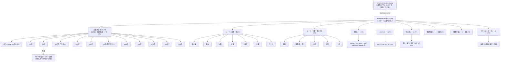

# PLAN.md — パーツ生成方式の現行方針(Gemini移行)

出典: [`amanesf/new2D3D`](https://github.com/amanesf/new2D3D) の
`SUPER_LIVE2D_V3_PLAN.md` §6.5(2026-07-21時点のまとめ)。パーツ生成の主軸を
Gemini 3.1 Flash Image Preview(Nano Banana 2)に切り替えるという判断のみを
引き継ぎ、それ以外の設計は下記の方針でこのリポジトリ独自に組み直す。実装
コードはまだ書いていない — Gemini APIキーが用意され、実際の生成呼び出しが
許可された時点で着手する。

## 設計方針(2026-07-21改訂)

- **旧SD1.5世代(MeinaMix+ControlNet/IP-Adapter)の検証結果や、それを前提に
  組まれた旧エンジンの制約は、Geminiでの設計には持ち込まない。** 別モデル
  ・別世代の弱点を回避するために編み出した手法(境界の3原則、決定的穴埋め、
  独立生成の可否判断など)であり、Geminiの実力を試す前に選択肢を狭める
  だけになる
- **実現性は「試す前から間引く」のではなく、小さく実地で試して確かめる。**
  リスクが高そうという理由だけでカテゴリを後回しにしない。まず小規模に
  1回試し、結果を見てから本番の枚数・範囲を決める
- **切り分け(パーツの分解・セグメンテーション)自体もGeminiにやらせる。**
  1枚のマスター画像を人手やSAM等のアルゴリズムで抜き出すのではなく、
  「このパーツだけを透過背景で描いて」と個別に依頼する。隠れて見えない
  部分(髪の下の胴体など)も、穴埋めスクリプトではなく**Geminiに自然な
  続きとして直接生成させる**。旧エンジンでSD inpaintingが失敗した領域
  (幻覚生成)は、旧世代モデル+局所穴埋めという組み合わせの弱点であり、
  Geminiによるパーツ単位のフルジェネレーションでは別の話として再検証する
- 座標のハードコードを避ける(全キャラ共通のマニフェスト駆動)という
  エンジニアリング上の原則そのものは維持する。これは特定モデルの弱点回避
  ではなく一般的な設計原則のため

## 標準テンプレート(2キャラ目再利用の基盤)

- **キャンバス**: 900×1600(9:16、縦長)固定。パーツを拡大して使う場面
  (顔まわりのクロップ等)を考慮して、旧案(768×1024)より高さを引き
  上げた。Geminiは概ね入力と同じ解像度で出力する傾向があるため、**Gemini
  に渡す入力画像(元画像・テンプレ画像とも)は出力させたい解像度と同じ
  900×1600に揃える**
- **基準ポーズ**: 全身直立。髪が肩に軽くかかる程度の自然な重なりは問題
  ない(パーツは個別生成するため抜き取り不能問題はそもそも発生しない)。
  **ただし肘を大きく曲げる・小物を持つ・ケープが片側に大きく流れる、
  といった動きの大きいポーズは避ける**(1回目テストで判明。後述)
- **背景**: 単色固定(キー抜き用)
- **標準ピボット表**: 頭=首の付け根、肩=左右対称位置、股関節=腰位置を
  キャンバス比率(正規化座標)で定義。次のキャラでもこの比率に合わせて
  ポーズ参照画像を用意すれば、リグ(ボーン位置・ワープメッシュ)を
  流用できる

### 実体ファイル(`reference/`)

Gemini呼び出しには**元画像とテンプレ画像の2枚を毎回添付する**運用にする
(ユーザー方針)。実体をこのリポジトリに登録済み:

- [`reference/master_v1.png`](./reference/master_v1.png)(900×1600): ユーザー
  提供の原画からスマホスクリーンショットの黒帯を除去し、標準キャンバスに
  合わせてリサイズ・中央配置したもの。**動きの大きいアクションポーズ**
  (片腕を曲げて発光する球体を持つ)のため、以後の生成には直接使わない
  (次項参照)。原画そのものの記録として残す
- [`reference/master_v2.png`](./reference/master_v2.png)(900×1600):
  `prompts/front_view_v2.txt`で正面直立ポーズに整形し直した結果
  (2026-07-21、実際にGeminiで生成・成功確認済み)。**以後の全カテゴリで
  使う正式な元画像はこちら**。全身正面(0度)を向き、腕は体から離れ、
  素手、髪型は原画と同じ単一のポニーテール(非対称)を維持している
- [`reference/template_grid_v1.png`](./reference/template_grid_v1.png)
  (900×1600): 2列×4行=8セル(セルサイズ450×400、番号1〜8を左上から読み順
  で採番)のグリッドガイド。**テンプレ画像(出力レイアウトの配置ガイド)**
  として、**タイル生成系のカテゴリ(表情・viseme・手の形・レイヤー分解・
  関節可動・アクション)のみ**添付する。カテゴリごとの必要タイル数は最大7
  (表情シート・レイヤー分解(体))なので8セルで共通カバーできる。未使用
  セルは背景のまま空けてよい、とプロンプトで明示する
- **回転角度セット(#4)ではテンプレ画像を使わない**(次項「テンプレート
  の見直し」を参照)。マスター(#1)と同じく、参照画像1枚だけを添付する
  単体画像生成として扱う

### テンプレートの見直し(2026-07-21、確実性のため)

1回目テストでグリッド線の写り込み・セル間のはみ出しが実際に発生した
ことを踏まえ、**カテゴリの性質によってテンプレ画像を使う/使わないを
分ける**方針にした:

- **タイル生成が適する場合**: 同じスケールの小さな状態差分を複数並べる
  カテゴリ(表情・viseme・手の形・レイヤー分解・関節可動・アクション)。
  実証済みの表情シート方式に近く、8セルグリッドの流用が効く
- **単体画像生成にする場合**: 1回の呼び出しで「1枚の完成した全身図」を
  作るカテゴリ(マスター/正面図・回転角度セット)。グリッドに詰め込む
  必要がなく、実際にマスター生成(前面図)が1枚画像・テンプレなしで
  高品質に成功しているため、**同じ方式を回転角度セットにも適用する**。
  複数角度を1枚のシートに詰め込む案は、キャンバスが横に間延びする・
  グリッド線問題を抱え込む、という理由で採用しない

**2枚渡しに関する設計上の注意点(要検証)**:

- テンプレ画像のグリッド線・番号がそのまま出力に写り込むリスクがある。
  プロンプトに「テンプレ画像のグリッド線・数字は配置の目安であり、出力
  画像には描き込まない」旨を必ず明記する(次項プロンプト設計に反映)
- 8セル均等グリッド(450×400、横長寄り)は表情・手の形のような近い
  アスペクト比のタイルには適するが、腕・脚のような縦に長いパーツの
  レイヤー分解ではセルが窮屈になる可能性がある。この場合は該当カテゴリ
  だけ「隣接する2セル分を1パーツに使ってよい」と指示する運用で吸収する
  (テンプレ画像自体は複数種類作らず1つに統一する)
- `master_v1.png`は等比縮小の結果、上下に約224pxずつの余白がある(キャラ
  クター部分の実高さは約1152px)。ピボット正規化座標のキャリブレーション
  はこの余白込みの座標系で行う

## パーツ・画像枚数(再設計)

全カテゴリをフラットに候補として扱う。事前の間引きはしないが、まず1回
小さく試してから本番投入する、という進め方は徹底する。

**この枚数見積もりは「1シート=1呼び出しで成功する」という未検証の仮定に
立っている。** 実証済みなのは表情シート方式(同一キャラの全身/顔が写った
状態を複数タイルに並べるタスク)のみで、以下の表の#5・#10はこれと同型
なので1回で通る見込みが比較的高い。一方#2・#3(1タイルに1パーツだけを
透過背景で単独描画)と#8・#9(同じ関節を複数ポーズ、かつ切り分け済みで)
は、実証例とは質的に異なる複合タスクで、成功する保証はない。まとめ込みが
崩れた場合はパーツ・状態を個別呼び出しに分割する必要があり、その場合の
現実的な枚数は表の下の「悲観シナリオ」を参照。

| # | カテゴリ | 内容 | 生成単位 | 呼び出し目安(楽観) |
|---|---|---|---|---|
| 1 | マスター | 正面直立ポーズ全身1枚 | 単独画像 | 1(**完了**) |
| 2 | レイヤー分解(体) | 後ろ髪/胴/右腕/左腕/右脚/左脚/ケープ、各パーツを透過背景で個別生成 | 1シートにタイル化(未検証) | 1 |
| 3 | レイヤー分解(顔まわり) | 前髪/頭部(顔・首)/右目/左目/口、各パーツを透過背景で個別生成 | 1シートにタイル化(未検証) | 1 |
| 4 | 回転角度セット | 0/30/60/90/120/150/180/210/240/270/300/330度の全身像、**12方向すべて個別生成(ミラーなし)** | 単独画像×12(テンプレ画像は使わない) | 12 |
| 5 | 表情シート | neutral+VRM標準6表情 | 1シートにタイル化(実証済み手法と同型) | 1 |
| 6 | visemeシート | aa/ih/ou/ee/oh/rest | 1シートにタイル化(実証済み手法と同型) | 1 |
| 7 | 手の形シート | 開手/握り/指差し/マイク持ち(片手、反対はミラー候補) | 1シートにタイル化(単独パーツ切り分けなので#2・#3寄りの未検証) | 1 |
| 8 | 関節可動シート(肩・肘) | 下ろす/上げる/前に出す/後ろに引く 等 | 1シートにタイル化(未検証) | 1 |
| 9 | 関節可動シート(股・膝) | 直立/歩行中間/しゃがみ 等 | 1シートにタイル化(未検証) | 1 |
| 10 | アクションポーズシート | 挨拶(手を振る)/お辞儀/頷き/待機 | 1シートにタイル化(実証済み手法と同型) | 1 |
| | **合計(楽観)** | | | **約21回** |

回転角度セット(#4)が1→12回に増えたのが最大の変更点(次項参照)。
これは楽観/悲観の幅ではなく、**方針として最初から個別生成に決め打ち**
した結果(ミラーが使えないため、そもそも「1シートにまとめて成功したら
1回で済む」という余地がない)。

**悲観シナリオ(#2・#3・#7・#8・#9のまとめ込みが崩れ、パーツ/状態ごとに
個別呼び出しが必要になった場合)**: #2(7パーツ個別)+#3(5パーツ個別)+
#7(4状態個別)+#8(4状態個別)+#9(3状態個別)を分解すると、
マスター1+分解体7+分解顔5+角度12(変わらず)+表情1+viseme1+手4+関節肩肘4+
関節股膝3+アクション1 = **約39回**。さらに生成は確率的なので、一定割合は
再ロールが必要になる前提を置くと、実運用では**45〜50回前後**まで見て
おくのが安全。

### 回転角度セットの再設計(2026-07-21、30度刻み・ミラー廃止)

**変更点**: 旧案(5角度生成+ミラーで反対側)を廃止し、**0度から330度まで
30度刻みの12方向すべてを個別に生成する**。

**ミラーを廃止した理由**: このキャラクターは後ろ髪(ポニーテール)が
体の片側からしか流れていない、**左右非対称なデザイン**である。仮に
30度の画像を鏡像反転して330度の画像として使うと、ポニーテールが本来と
逆の位置に描画されてしまい、キャラクターとして誤りになる。左右対称な
キャラクターであればミラーで半分の呼び出し数に節約できるが、**対称性は
キャラごとに確認が必要な前提であり、既定では仮定しない**(次項「左右
対称・非対称の扱い」参照)。

**正面付近だけフル分解、側面・背面は丸ごとスプライトという設計は維持**:
12方向すべてをレイヤー分解(#2・#3)まで行うと呼び出しが12倍に膨らむため、
正面付近(概ね0°・30°・330°、表情や関節の動きが視認できる範囲)だけ
#2・#3のフル分解リグを適用し、それより外側(60°〜300°)は**分解せず
全身1枚のスプライトとして角度ごと丸ごと差し替える**。側面・背面でも
表情やアクションを表現したくなった場合は、その時点で該当角度だけ追加で
レイヤー分解シートを作る(逐次追加可能な設計)。

**生成方法**: マスター(#1、0度)を参照画像として毎回添付し、
[`prompts/angle_turntable_v2.txt`](./prompts/angle_turntable_v2.txt)の
`{ANGLE}`/`{VIEW_LABEL}`/`{OCCLUSION_NOTE}`を差し替えて個別に呼び出す。
角度間で前の生成結果をつなぐ(img2imgチェーン)のではなく、**毎回同じ
マスター画像を基準にする**(旧SD1.5系検証⑫⑬のimg2imgチェーンは連続性と
引き換えに回転量が乗らない問題があったため、そのパターンは踏襲しない)。

### 支払う前にプロンプトを詰める(2026-07-21、進め方の反省)

「試して失敗を見てから直す」を繰り返すと、生成1回ごとに費用がかかる
以上、費用のかかるデバッグになってしまう。`prompts/angle_turntable_v1.txt`
を実際に支払って試す前に読み返し、机上で見つけられたはずの問題を3つ
発見したため、支払う前に`v2`へ修正した:

1. **「yaw」という3D用語だけに頼っていた**。旧SD1.5系検証⑩で「side
   view, profile」のような自然な絵の語彙の方が技術タグより実際に効いた
   実績があり、アニメ画像生成が3Dカメラ用語(yaw/pitch/roll)をどこまで
   正確に解釈するかは未検証。v2では角度の数値と自然な視点ラベル
   (「右側面・プロフィール」等)を併記する
2. **カメラが回るのか被写体が回るのか、文中の言い方が矛盾していた**。
   【カメラ】欄で「カメラのyaw」、【ポーズ】欄で「キャラクター自体を
   回転」と両方の言い方が混在していた。v2は「カメラは固定・キャラクター
   が回転する」で一貫させた
3. **オクルージョン(隠れ方)の指示が抜けていた**。このキャラのポニー
   テールは体の左側からしか流れていない非対称デザインのため、右90度
   (体の右側面)から見るとポニーテールは体の陰にほぼ隠れるはずで、
   左270度から見ると逆に手前に大きく見えるはず。この一貫した隠れ方の
   ロジックを明示しないと、角度ごとにモデルが矛盾した解釈をする
   リスクが高い(独立生成間の同一性崩れの一因になりうる)。v2では角度
   ごとに`{OCCLUSION_NOTE}`で見え方を明示する

12角度ぶんの`{VIEW_LABEL}`/`{OCCLUSION_NOTE}`は以下の通り(ポニーテールが
画面向かって左側から流れる前提。0度=参照画像そのもの):

| 角度 | VIEW_LABEL | OCCLUSION_NOTE(ポニーテールの見え方) |
|---|---|---|
| 0° | 正面 | 参照画像通り、体の左側に垂れて見える |
| 30° | 正面やや右向き | 画面左寄りに見え続ける、位置がわずかに変化 |
| 60° | 右斜め前(3/4ビュー) | 体の奥側に回り込み始め、一部が体の陰に隠れ始める |
| 90° | 右側面(プロフィール、右向き) | ほぼ体の陰に隠れて見えない、または背中側にわずかに見える程度。無理に手前に描かない |
| 120° | 右斜め後ろ | 背面側に回り込み、輪郭の外側(向かって右・背中側)に見え始める |
| 150° | 背面寄り(やや右) | 背中の右寄りに垂れて見える |
| 180° | 背面(真後ろ) | 背中側、画面中央よりやや右寄りに大きく見える(正面で左だったものは背面から見ると右) |
| 210° | 背面寄り(やや左) | 背中の中央〜左寄りにかけて見える |
| 240° | 左斜め後ろ | 輪郭の外側(向かって左・背中側)に大きく見え始める |
| 270° | 左側面(プロフィール、左向き) | 体の手前側から流れてくるため、手前に大きくはっきり見える(90度の逆) |
| 300° | 左斜め前 | 手前に大きく見えるが、一部は体の後ろに回り込み始める |
| 330° | 正面やや左向き | 画面左側に大きく、正面に近い形で見える |

**最初に試す1枚**: 全12方向の中で最もオクルージョン推論が難しい**90度
(右側面)**を単独でまず試す。ここが通れば残りの角度は相対的に易しい
(正面寄りほど隠れ方の変化が単純なため)。4方向いっぺんに試すより
出費を抑えつつ、最難関1枚で設計の妥当性を確認できる。

### 左右対称・非対称の扱い(2026-07-21追加)

キャラクター全体が左右対称という前提は置かない。パーツごとに個別判断
する:

- **後ろ髪(ポニーテール)**: 非対称(体の片側にしか無い)。ミラー対象外、
  独立パーツとして単独生成する(既存設計のまま変更なし)
- **回転角度セット**: 上記の通りミラー不可、12方向すべて個別生成
- **腕(袖・グローブ)・脚(ソックス・靴)**: マスター画像を見る限り左右
  対称なデザインに見えるため、片側を生成しミラーで対応する運用を維持
  する**候補**とする。ただし本番投入前に、実際に生成した片側画像と原画の
  反対側を見比べて対称性を確認するステップを挟み、思い込みで決めない
- 今後パーツやキャラクターが増えるたびに対称/非対称を都度確認し、
  マニフェストの`mirror_of`の有無で明示する(既定値はミラーしない側に
  倒す。ミラーは確認が取れた場合のみの最適化とする)

## 画像アセットのツリー構造

どの画像がどの画像から派生するかの依存関係を図にした(GitHub上で
Mermaidとして描画される)。太字は完了済み:



正面付近(0°・30°・330°)はレイヤー分解(#2・#3)まで行うが、それ以外の
角度(60°〜300°)は当面「全身1枚のスプライト」のまま(点線部分は将来の
拡張であり、現時点では未着手・未確定)。

## 組み立て方(アセンブリ)

- 各パーツはGeminiが**既に透過背景で切り分けた状態**で出てくる前提の
  ため、組み立てスクリプト側でセグメンテーションは行わない。シートから
  タイル位置ごとに切り出す(決定的スクリプト、AI不使用)だけでよい
- ピボット位置は「標準ピボット表(正規化座標)× パーツのアルファ
  バウンディングボックス」から自動算出する。手作業の座標指定・境界線の
  ドラッグ指定はしない
- 連続的な動き(呼吸・視線スライド・小角度の首振り・ポニーテールや
  ケープの揺れ)は、生成した1枚の画像に対するメッシュ変形/ソフトマスクで
  作る。これは「旧エンジンで実証済みだから安全」という理由ではなく、
  生成AIでピクセル単位の滑らかな中割りを大量生産するのが非現実的なため
  (どの画像生成モデルでも同様)。**ただし今回の新テンプレート・新パーツ
  分解では未検証**なので、実装後に必ずQC(境界のズームクロップ確認)を行う
- 離散状態(表情/viseme/手の形/関節ポーズ/アクション/角度スプライト)は
  クロスフェードで切り替える。生成した複数の画像同士を頂点補間でつなぐ
  ことはしない(ピクセル単位の連続性が保証される保証がないため)

## プロンプト設計

Gemini呼び出しは**元画像(`reference/master_v2.png`、タイル生成系のみ
+テンプレ画像`reference/template_grid_v1.png`も添付)**を毎回添付した
上で、全カテゴリで以下の型に統一する(回転角度セット・マスター生成は
テンプレ画像を使わず元画像1枚のみ。前掲「テンプレートの見直し」参照):

1. **2枚それぞれの役割を明示する**: 「1枚目の画像はキャラクターの参照
   (識別要素・画風の手本)。2枚目の画像は出力する配置のレイアウトガイド
   (グリッドと番号)であり、出力画像そのものにはこのグリッド線・番号を
   描き込まない」と明記する。テンプレ画像の線がそのまま出力に写り込む
   リスクがあるため、この否定形の指示は省略しない
2. **使用するセル番号と内容を対応づける**: 「テンプレ画像のセル1は
   [状態A]、セル2は[状態B]…」のようにテンプレ画像の番号と内容を1対1で
   指定する。使わないセル(8セル未満のカテゴリ)は「背景のまま空けて
   よい」と明記する
3. **出力解像度をテンプレ画像に揃えるよう指示する**: 「出力はテンプレ
   画像と同じ900×1600、同じセル位置で」と明記し、Geminiが入力と同じ
   解像度で出力する傾向を利用する
4. **各タイルの背景指定を明確にする**: レイヤー分解シート(#2・#3)は
   「各セルは対象パーツ単体を透過(または単色キー)背景で描く。他の
   パーツは含めない」と明記する
5. **隠れた部分の補完を明示的に指示する**: 「胴体は髪や腕で隠れている
   部分も、衣装として自然に続く形で補完して描く」のように、穴を残さず
   生成で埋めるよう依頼する(旧エンジンの決定的穴埋めスクリプトの代わり)
6. **識別要素・画風とも、テキストで書き下さず元画像を踏襲させる**:
   髪色・瞳の色・ヘッドセットの意匠・衣装配色・線の太さ・塗り方・配色の
   トーンは、どれも1枚目(元画像)に既に写っている情報であり、テキストで
   重ねて書き下すのは冗長かつ記述ミスで画像と食い違うリスクがある。
   「色・意匠・画風は1枚目の元画像をそのまま踏襲すること」という一文で
   済ませ、個別の色指定は書かない。背景色(キー抜き用の単色指定)だけは
   画像に写っていない機能要件のため文章で別途明記する
7. **変更してよい範囲/してはいけない範囲を分離する**: 「表情(目・口)
   以外は変更しない」のように対象を限定する一文を必ず入れる

### プロンプトの構造(2026-07-21改訂)

実際に書いたプロンプトが散文で長く、キャラ固有の名詞(ケープ・
ポニーテール等)がポーズ指定にまで混ざって2キャラ目に使い回せない、
カメラ指定が「正面」だけで弱い、という指摘を受けて構造を見直した。
以後のプロンプトは以下の**ラベル付きセクション**で統一し、各セクションは
短い箇条書きに留める:

```
【役割】このプロンプトが何をする呼び出しかを1文で
【カメラ】(構図が要る場合のみ)yaw/pitch/roll・パースの強さ・
         ショットの範囲を明示的な数値・用語で指定する。
         「正面」だけのような曖昧な語だけに頼らない。**カメラの向きと
         被写体(キャラ本体)の向きは別物**なので、カメラをyaw0°にする
         だけでなく「体・顔もカメラ方向を正面から向く、半身/斜め立ちに
         しない」のように被写体側の向きも明記する
【ポーズ】(必要な場合)体勢の指定。キャラ固有のパーツ名は避け、
         「垂れ下がる要素は左右対称に」のように次のキャラにも
         使い回せる言い方にする
【背景】/【出力】 解像度・枚数・グリッド有無
【セル内容】(タイル生成の場合のみ)セル番号ごとの内容を短い箇条書きで
【禁止】 やってはいけないことを短く列挙
```

**汎用化の線引き**: ポーズ・カメラ・背景・出力形式の指定は次のキャラにも
そのまま使える言い方にする(構造テンプレートとして再利用)。一方、
レイヤー分解のセル内容(このキャラにはケープがある、等)は**キャラごとに
異なって当然**なので、そこは無理に抽象化せず具体的なパーツ名を書く
(曖昧にすると切り分け精度が落ちる)。汎用化するのは構造であって、
中身の具体性を犠牲にしない。

この構造に合わせて[`prompts/front_view_v2.txt`](./prompts/front_view_v2.txt)
と[`prompts/body_layers_v3.txt`](./prompts/body_layers_v3.txt)を作成した
(v1・v2の散文版は経緯として残す)。

**正面図生成テストでの発見**: `front_view_v2.txt`の「垂れ下がる要素は
左右対称に」という指示(ケープが片側に大きく流れる問題への対策として
追加)が、髪型そのものをツインテールに変えてしまう副作用を起こした。
「左右対称に」という汎用的な言い回しが、ポーズ由来の装飾の流れ方
(消したかった対象)と、識別要素であるヘアスタイル(消してはいけない
対象)を区別できず、両方に効いてしまったため。この指示は削除し、
代わりに「髪型は参照画像のまま変更しない」と識別要素側を直接保護する
指示に置き換えた。**汎用的な言い回しがキャラの識別要素を意図せず
変えてしまうリスクがある**という教訓として記録する(ケープの非対称な
流れが再発した場合は、ヘアスタイルを名指しで除外した上で改めて対策する)。

## 進め方(試してから広げる、2026-07-21再構成)

マスター(#1・正面図)の生成が成功したことを受け、実施順序を組み直した。
事前にリスクで足切りはしないが、いきなり全カテゴリを本番投入はせず、
1カテゴリずつ小さく試して結果を見てから広げる:

1. **マスター(#1)確定 — 完了**: `reference/master_v2.png`(正面直立
   ポーズ)を以後の元画像として確定
2. **回転角度セット(#4)をまず少数角度で試す** — 12方向いきなり全部では
   なく、まず**90度・180度の2枚**を`prompts/angle_turntable_v1.txt`で
   個別生成し、マスター(0度)と識別要素(髪色・瞳・ヘッドセット・衣装)
   が一致するか、ポニーテールが角度なりに正しい位置へ移動しているかを
   確認する。ここが本命の新規リスク(独立生成間の同一性)なので優先度を
   上げた。通れば残り10角度(30/60/120/150/210/240/270/300/330 + 未生成分)
   を埋める
3. **レイヤー分解(#2)を1シートだけ試す**(マスターを元画像として使用し
   `prompts/body_layers_v3.txt`で再試行) — 「1タイル1パーツを透過背景
   単独描画」「隠れた部分の自然な補完」が同時に成立するかを確認する。
   ここが崩れた場合(パーツが混ざる・透過が汚い・補完が破綻する等)は、
   その場でパーツ1つずつの個別呼び出しに切り替える(#3・#7も同様の構造
   なので同じ結論が転用できる)
4. 前ステップ(カテゴリ#2)の結果を踏まえて、カテゴリ#3(顔まわり)・
   #7(手の形)を同じ粒度で試す
5. 表情・viseme・アクション(#5・#6・#10、実証済み手法と同型)は比較的
   安心して試せるが、念のため1シートずつ確認する
6. 関節可動シート(#8・#9)を試す — レイヤー分解(#2)と同じ「複合タスクが
   1回で通るか」の論点が再度出るため、#2の結果からある程度予測はつくはず
7. 正面付近(0°・30°・330°)以外の角度(60°〜300°)で表情/アクションが
   必要になった場合、その時点で該当角度のレイヤー分解シートを追加する
8. 通った範囲から組み立てスクリプト・マニフェストを実装し、QCで境界を
   確認する

### 最初のプロンプト(#2 レイヤー分解・体)

[`prompts/body_layers_v1.txt`](./prompts/body_layers_v1.txt)に実際に投げる
プロンプト文面を用意した。`reference/master_v1.png`(元画像)+
`reference/template_grid_v1.png`(テンプレ画像)の2枚を添付した上でこの
プロンプトを送る。背景指定は「透過」ではなく確実に切り出せる**クロマキー
単色(#00FF00)**を採用した。結果を見て確認すべき点:

- 8パーツ同時の切り分けが破綻せずに揃うか(混ざる/はみ出す)
- 胴体(セル2)の「隠れた部分の補完」が不自然にならないか
- クロマキー背景が単色で抜けるか
- テンプレ画像のグリッド線が出力に写り込んでいないか

この結果次第で、他カテゴリ(#3顔まわり・#4回転角度・#7〜#9等)向けの
プロンプトも同じ型で作る。

### 1回目テスト結果(2026-07-21、観察記録)

`prompts/body_layers_v1.txt`で実際に生成した結果を
[`results/body_layers_v1_result.png`](./results/body_layers_v1_result.png)
に記録。目視確認できた事実:

**うまくいった点**:
- クロマキー背景はほぼ単色(#00FF00)で綺麗に出ており、キーイングに使えそう
- 髪・胴体の色/意匠/画風は元画像とよく一致している。**テキストで色を
  書き下さなくても元画像を見て踏襲できている**(前回の設計修正の判断が
  裏付けられた)

**問題点(すべて実際に発生を確認)**:
- **テンプレ画像のグリッド線・境界が出力にそのまま描き込まれた**(禁止
  指示を出したが効かなかった)
- **出力解像度が900×1600ではなく768×1364だった**。ただしアスペクト比は
  768/1364≈0.563で指定した900/1600=0.5625とほぼ一致しており、Geminiは
  絶対ピクセル数より縦横比を優先している可能性がある。**組み立て
  スクリプト側は「指定解像度ぴったりで返る」ことを前提にせず、受け
  取った画像を標準キャンバスへ機械的にリサイズする前提で設計する**
- **ケープ(セル7)が独立して出ず、脚のセル(5・6)側に染み出した**。
  代わりにセル7・8には(指定していない)靴が分割されて描かれた。大きく
  他パーツと重なり合う装飾パーツの単独抜き出しは崩れやすいと判明
- **セル8(空白指定)にキラキラ装飾+靴が描かれ、空白指示が無視された**
- **腕(セル3・4)に「手は含めない」のに指先が写り込み、かつ肩関節からで
  はなく前腕あたりから始まっていた**(境界の指定が弱かった)

**診断(2回目更新)**: 当初はプロンプトの指示強度不足のみが原因と考え
`prompts/body_layers_v2.txt`で指示を強化したが、**より根本的な要因として
元画像そのものが標準ポーズ(全身直立)ではなく、片腕を曲げて発光する
球体を持ち、ケープが片側に大きく流れる動きの大きいアクションポーズ
だった**ことに気づいた(ユーザー指摘)。ケープが脚に染み出したのも、
腕に手が写り込み境界が不明瞭だったのも、単にプロンプトの指示が弱かった
からではなく、**そもそも元のポーズ自体が「ケープが脚に重なる」「腕が
肘で曲がり手が体の中心に来る」という、分解しづらい構図だった**ことが
主因と考えられる。

対策として、レイヤー分解の前に**正面直立ポーズへの整形(#1マスター
生成)を独立した工程として挟む**。元画像を参照しつつ、腕を体から離した
自然な直立ポーズ・小物を持たない素手・垂れ下がる要素を左右対称に垂らした
状態に描き直させ、その結果を新しい元画像(`master_v2`相当)としてレイヤー
分解に使う。プロンプトの指示強化と、ポーズの正規化は**両方とも必要**と
判断し、両方を次の試行に反映する:

- [`prompts/front_view_v2.txt`](./prompts/front_view_v2.txt): 元画像から
  正面直立ポーズを生成する(次に試すべき最初のステップ。散文だった
  v1は構造化・汎用化・短縮の指摘を受けてv2に置き換えた)
- [`prompts/body_layers_v3.txt`](./prompts/body_layers_v3.txt): グリッド線
  非表示の強調・ケープの相互排他明記・空白セルの明記・腕の境界明確化を
  ラベル付きセクションの構造に落とし込んだレイヤー分解プロンプト(正面
  直立ポーズの結果を元画像として使う。v1・v2の散文版はプロンプト設計
  §「プロンプトの構造」の経緯として残す)

両方を適用してもv1と同種の問題が残る場合は、1呼び出しでの一括分解を
諦め、パーツごとの個別呼び出しに切り替える(進め方の「悲観シナリオ」に
移行)。

## パーツマニフェスト設計(たたき台)

```json
{
  "size": [900, 1600],
  "template_version": "std-v1",
  "pivots_normalized": {
    "head": [0.50, 0.32],
    "shoulder_r": [0.62, 0.40],
    "shoulder_l": [0.38, 0.40],
    "hip": [0.50, 0.58]
  },
  "parts": {
    "torso":    { "motion": "static-cutout", "source_sheet": "layers_body_v1.png" },
    "hair_back":{ "motion": "procedural-mesh", "source_sheet": "layers_body_v1.png", "symmetry": "asymmetric" },
    "cape":     { "motion": "procedural-mesh", "source_sheet": "layers_body_v1.png" },
    "arm_r":    { "motion": "discrete-crossfade", "states": ["rest","raised","forward","back"], "source_sheet": "joint_arm_v1.png" },
    "arm_l":    { "mirror_of": "arm_r", "mirror_confirmed": false },
    "face": {
      "motion": "discrete-crossfade",
      "states": { "neutral": {}, "joy": {}, "aa": { "group": "viseme" } },
      "source_sheet": "expr_sheet_v1.png"
    },
    "hand_r":   { "motion": "discrete-crossfade", "states": ["open","fist","point","mic"], "source_sheet": "hand_sheet_v1.png" },
    "hand_l":   { "mirror_of": "hand_r", "mirror_confirmed": false },
    "body_angle": {
      "motion": "discrete-crossfade",
      "states": ["0","30","60","90","120","150","180","210","240","270","300","330"],
      "mirror": false,
      "note": "非対称デザイン(片側ポニーテール)のため12方向すべて個別生成。0/30/330のみフル分解リグ、60〜300は全身スプライト",
      "source": "angle_turntable_v1.txt を角度ごとに個別呼び出し"
    }
  },
  "draw_order": ["body_angle", "torso", "hair_back", "cape", "arm_l", "arm_r", "face", "hand_l", "hand_r"]
}
```

`mirror_confirmed: false`は「デザイン上ミラーできそうだが未確認」という
状態を表すフラグで、実際に反対側を目視確認してから`true`にする(既定で
ミラーを信用しないという方針をマニフェストのレベルでも表現する)。
`body_angle`は12方向の全身スプライト差し替えで、`mirror: false`により
角度ごとに独立した画像を持つことを明示している。この形式は確定ではなく、
実装着手時に見直す前提のたたき台。

## 次のアクション

1. **マスター(#1)— 完了**: `reference/master_v2.png`(正面直立ポーズ)
2. 回転角度セット(#4)を`prompts/angle_turntable_v1.txt`(`{ANGLE}`を
   差し替え)+`reference/master_v2.png`1枚のみ添付で、まず90度・180度の
   2枚を試す。識別要素の一致・ポニーテールの位置が正しいかを確認してから
   残り角度を埋める
3. 並行して`reference/master_v2.png`+`reference/template_grid_v1.png`の
   2枚でレイヤー分解(#2・#3、`prompts/body_layers_v3.txt`)を試す
4. 通った範囲から表情/viseme/手の形/関節/アクション(#5〜#10)を1シートずつ
   試しながら広げる
5. 組み立てスクリプト(タイル切り出し・ピボット自動算出)とWebGLビューアは、
   レイヤー分解シートの結果が見えた時点でこのリポジトリで新規実装する
