# PLAN.md — パーツ生成方式の現行方針(Gemini移行)

出典: [`amanesf/new2D3D`](https://github.com/amanesf/new2D3D) の
`SUPER_LIVE2D_V3_PLAN.md` §6.5(2026-07-21時点のまとめ)。パーツ生成の主軸を
Gemini 3.1 Flash Image Preview(Nano Banana 2)に切り替えるという判断のみを
引き継ぎ、それ以外の設計は下記の方針でこのリポジトリ独自に組み直す。実装
コードはまだ書いていない — Gemini APIキーが用意され、実際の生成呼び出しが
許可された時点で着手する。

## 現在地サマリー(2026-07-21時点)

> **重要(2026-07-22)**: 3観点の全体レビュー(①パイプラインの決定論性
> ②モーションの滑らかさ ③ツールの構造・機能・運用)を実施し、その結果を
> 文末の「**全体レビューによる設計改訂(2026-07-22)**」節に反映した。
> **シート方式の廃止→1パーツ1呼び出しのin-situ生成への転換**を含む大きな
> 改訂のため、以下の各節のうちシート/セル方式・パーツ別関節検出を前提と
> した記述はその節の内容で置き換えられている。

- **確定した設計方針(最新)**: Gemini API利用前提(従量課金は総額数ドル
  〜数十ドル程度と判明し、過度なコスト回避は不要と判断)。**顔まわりの
  繊細な差分(表情・viseme・手の形状)は正面±30度(0°・30°・330°)のみ
  フル充実。ロコモーション(歩く・走る・跳ぶ)は角度を問わず必要な
  範囲に広げる(背面から見た「走り去る」等の絵も要るため)**。プロンプト
  文面は結局いつも人(今はClaude)が書くものなので大仰な「層」とは
  扱わないが、キャンバス規格・前処理・命名規則・マニフェストといった
  使い回せる部分は`prompts/`のテキストと分けて整理する。入力画像は
  [`scripts/normalize_reference.js`](./scripts/normalize_reference.js)で
  毎回同じ規則(**1024×1024の正方形**キャンバス、キャラクター高さ896px
  に統一。Geminiの1K課金枠を無駄にしない正方形に2026-07-21変更)で
  前処理する
- **完了**: マスター(正面直立ポーズ)生成→前処理スクリプトで正規化済み
  → [`reference/master_v2.png`](./reference/master_v2.png)
- **1回試して不合格・原因診断済み**: レイヤー分解(体、#2)。グリッド線の
  写り込み・ケープが脚に染み出す・空白セル無視・腕に手が写り込む、の
  4点を確認。原因は(a)当時の元画像が動きの大きいポーズだったこと、
  (b)プロンプトの指示強度不足、の複合と判断。マスターを正面直立に
  差し替え、プロンプトを構造化した`body_layers_v3.txt`で再試行待ち
- **次に試す1枚(未実施)**: 回転角度セットのうち最難関の90度(右側面)。
  支払う前に机上レビューで3つの問題(3D用語への過信・カメラ/被写体の
  言い方の矛盾・非対称パーツのオクルージョン指示漏れ)を発見し修正済み。
  実行プロンプトは[`prompts/angle_090_test.txt`](./prompts/angle_090_test.txt)
  (添付する`reference/master_v2.png`は前処理スクリプトで上書き更新済み、
  プロンプト文面自体の変更は不要)
- **未着手**: レイヤー分解(顔)・表情/viseme/手の形シート・回転角度の
  残り11方向・組み立てスクリプト・**ブラウザビューア本体(パーツを骨格的
  に動かし、ジグル物理・まばたき・呼吸のような「生きてる感」を出す部分。
  次項参照、まだ設計に着手していない)**
- **プロダクトとしてのゴール(2026-07-21、ユーザーが明確化)**: 技術的な
  正しさそのものが目的ではなく、**「イラスト1枚を投入するだけで、Claude
  が都度手を入れなくてもそのキャラが動き出す」体験**が目的。姉妹
  リポジトリ`amanesf/ghostitd`(1枚の絵→3Dモデル生成→ブラウザビューアで
  ジグル物理・まばたき等を伴って動かす、という先行プロジェクト)から
  **「3Dの考え方を2Dに持ってくる」という考え方だけを共有**してもらった
  (仕組みを真似る話ではない)。ghostitdは1枚の平面絵から隠れた骨格を
  AI推定する必要があった(ランドマーク推定・キャリブレーション等が
  必要な逆問題)が、**super2DはGeminiが最初からパーツを分けて描く設計
  のため同じ逆問題は存在しない**。参考にすべきはghostitdの入力側の
  技術(推定・キャリブレーション)ではなく、`character_3d.html`が実現
  していた**完成後の体験(ブラウザ・ライブパラメータ編集・ジグル物理・
  まばたきレイヤー・呼吸)**の方
- **継ぎ目と動き量のトレードオフを拒否する(2026-07-21、ユーザー明確化)**:
  旧new2D3D/ghostitdの剛体変形エンジンは「動きを大きくすると継ぎ目・
  ゴーストが露出するので、動き量を小さく抑える」という妥協で回避して
  いた(前述の「メッシュ変形の問題」)。**super2Dではこの妥協はしない**。
  イラストが実際に動くことがこのプロダクトの核であり、継ぎ目は絶対に
  出さない(そのために分解境界の3原則・隠れ幅の設計は踏襲する)一方、
  それを理由に動きを控えることもしない。両立できない範囲の動き
  (剛体変形では隠れ幅を超えて破綻する等)は、**動きを諦めるのではなく
  以下のいずれかで解決する**:
  1. 隠れ幅の設計を動き量に合わせて広げる(静的な余白を大きく取る)
  2. **パーツにメッシュを貼って伸ばす**(関節部分を剛体回転ではなくメッシュ
     変形させ、素材自体を動きに合わせて伸縮させることで隠れ幅を動的に
     カバーする。Live2D/Spine等の関節メッシュと同じ考え方。固定の隠れ幅
     より広い可動域に対応できる)
  3. 生成AIの離散キーフレームに切り替える(上記2つでも足りない大きな
     動き・新しい形状の露出が要る場合)
  (パーツ・ビューア設計に着手する際の
  必須要件として明記)
- **今回の実現性検証全体で得た学び**: 旧new2D3D(SD1.5世代)の検証結果は
  前提として持ち込まない/切り分けもGeminiに行わせる/新しいプロンプトは
  支払って試す前に矛盾がないか机上レビューしてから渡す/入力画像の見かけ
  上のサイズは前処理で固定する/**技術的な類似に飛びつく前に、それが
  実際にこのプロジェクトのユーザー体験に資するか自問する**、の5点

詳細な経緯・判断根拠は以下の各セクションに時系列で残している。

## 設計方針(2026-07-21改訂)

- **旧SD1.5世代(MeinaMix+ControlNet/IP-Adapter)の検証結果や、それを前提に
  組まれた旧エンジンの制約は、Geminiでの設計には持ち込まない。** 別モデル
  ・別世代の弱点を回避するために編み出した手法(境界の3原則、決定的穴埋め、
  独立生成の可否判断など)であり、Geminiの実力を試す前に選択肢を狭める
  だけになる
- **実現性は「試す前から間引く」のではなく、小さく実地で試して確かめる。**
  リスクが高そうという理由だけでカテゴリを後回しにしない。まず小規模に
  1回試し、結果を見てから本番の枚数・範囲を決める
- **切り分け(パーツの分解・セグメンテーション)自体もGeminiにやらせる。**
  1枚のマスター画像を人手やSAM等のアルゴリズムで抜き出すのではなく、
  「このパーツだけを透過背景で描いて」と個別に依頼する。隠れて見えない
  部分(髪の下の胴体など)も、穴埋めスクリプトではなく**Geminiに自然な
  続きとして直接生成させる**。旧エンジンでSD inpaintingが失敗した領域
  (幻覚生成)は、旧世代モデル+局所穴埋めという組み合わせの弱点であり、
  Geminiによるパーツ単位のフルジェネレーションでは別の話として再検証する
- 座標のハードコードを避ける(全キャラ共通のマニフェスト駆動)という
  エンジニアリング上の原則そのものは維持する。これは特定モデルの弱点回避
  ではなく一般的な設計原則のため
- **Gemini利用を前提にコスト面での過度な慎重さは手放す**(2026-07-21、
  API従量課金は1枚$0.03〜0.07程度で、本計画全体の見積もり枚数でも
  総額数ドル〜数十ドル程度と判明済み)。ただし「支払う前にプロンプトを
  机上レビューする」習慣そのものは、コストを気にしなくても再現性・
  設計品質のために継続する

## 標準化の考え方(2026-07-21追加・訂正)

当初「モデル非依存/モデル依存」という2層に分けて説明したが、これは
言葉が大げさすぎた(プロンプト文面は結局モデルが何であっても毎回誰か
が書く必要があるもので、独立した「層」として持ち上げるほどの話では
ない、というユーザー指摘の通り)。実態はもっと単純:

- **使い回せるもの**: 標準キャンバス規格(1024×1024)・入力画像の前処理
  ルール・パーツ命名規則・マニフェストスキーマ・標準ピボット表・角度の
  刻み(30度)・パーツ分解の境界の考え方・組み立て方(クロスフェード/
  メッシュ変形の使い分け)。これらはGemini以外を使うことになっても
  そのまま流用できる
- **都度書き直すもの**: 実際のプロンプト文面。モデルが変わればどのみち
  書き直しが要る。ここは`prompts/`配下にテキストファイルとして置いて
  あるが、それは「整理のため」であって「モデル依存レイヤーを分離した
  設計」というような大層な話ではない

## 実装言語(2026-07-21確定)

**Gemini呼び出し自体(API/アプリ)以外は全てJavaScript(Node.js)で
実装する**。前処理スクリプト・組み立てスクリプト(タイル切り出し・
ピボット自動算出)・マニフェスト・WebGLビューア本体まで一貫してJSに
揃える(旧来Pythonで書いていた前処理スクリプトはNode.js+jimpに移植
済み)。

## 入力画像の前処理(標準化、2026-07-21追加)

Geminiに渡す入力画像(元画像・派生する参照画像すべて)は、手作業の
リサイズではなく**決定的スクリプトで毎回同じ規則に通す**:
[`scripts/normalize_reference.js`](./scripts/normalize_reference.js)
(Node.js、`jimp`使用。`node scripts/normalize_reference.js <src> <dst>`)

**規則**:
- 出力キャンバス: **1024×1024(正方形)**、白背景(標準テンプレートと
  同一)。Geminiの課金は解像度ティア単位(0.5K/1K/2K/4K、1K=長辺
  1024px)のため、9:16等の縦長キャンバスで長辺だけ1024pxに合わせると
  画素数枠(=同じ価格で使える解像度)を余らせて損をする。**正方形
  1024×1024にすることで同じ1K課金枠を無駄なく使う**(2026-07-21、
  ユーザー指摘により900×1600から変更)
- 入力画像の四隅の色を背景色として自動検出し、背景と異なる領域を
  キャラクター本体とみなしてバウンディングボックスを検出する
- バウンディングボックスの高さが**896px(キャンバス高さの87.5%)**に
  なるよう等比拡大縮小し、水平中央揃え・垂直中央揃えで配置する

**狙い**: 生成のたびにキャラクターの大きさ・位置がバラつくと、モデルが
毎回違う縮尺で解釈してしまい同一性のブレやレイアウトのズレの一因に
なりうる。**「キャラクターの見かけ上のサイズ」という変数を、入力の
時点で固定してしまう**ことで、モデル側の解釈のブレを減らす狙い。

[`reference/master_v2.png`](./reference/master_v2.png)はこのスクリプトで
正規化済み(バウンディングボックス543×896、オフセット(240, 64))。
今後生成する派生画像・2キャラ目の参照画像も同じスクリプトを通す。

## 標準テンプレート(2キャラ目再利用の基盤)

- **キャンバス**: **1024×1024の正方形**固定(2026-07-21、900×1600の
  縦長案から変更)。Geminiの課金は解像度ティア単位(1K=長辺1024px)
  のため、縦長キャンバスで長辺だけ合わせると画素数枠を余らせて損をする。
  正方形にすることで1K課金枠を無駄なく使う。Geminiは概ね入力と同じ
  解像度で出力する傾向があるため、**Geminiに渡す入力画像(元画像・
  テンプレ画像とも)は出力させたい解像度と同じ1024×1024に揃える**
- **基準ポーズ**: 全身直立。髪が肩に軽くかかる程度の自然な重なりは問題
  ない(パーツは個別生成するため抜き取り不能問題はそもそも発生しない)。
  **ただし肘を大きく曲げる・小物を持つ・ケープが片側に大きく流れる、
  といった動きの大きいポーズは避ける**(1回目テストで判明。後述)
- **背景**: 単色固定(キー抜き用)
- **標準ピボット表**: 頭=首の付け根、肩=左右対称位置、股関節=腰位置を
  キャンバス比率(正規化座標)で定義。次のキャラでもこの比率に合わせて
  ポーズ参照画像を用意すれば、リグ(ボーン位置・ワープメッシュ)を
  流用できる

### 実体ファイル(`reference/`)

Gemini呼び出しには**元画像とテンプレ画像の2枚を毎回添付する**運用にする
(ユーザー方針)。実体をこのリポジトリに登録済み:

- [`reference/master_v1.png`](./reference/master_v1.png)(900×1600、旧
  キャンバス規格): ユーザー提供の原画からスマホスクリーンショットの
  黒帯を除去したもの。**動きの大きいアクションポーズ**(片腕を曲げて
  発光する球体を持つ)のため、以後の生成には直接使わない(次項参照)。
  原画そのものの記録として残す(キャンバス規格変更の影響を受けない
  ただの参考画像のため再生成していない)
- [`reference/master_v2.png`](./reference/master_v2.png)(1024×1024):
  `prompts/front_view_v2.txt`で正面直立ポーズに整形し直した結果
  (2026-07-21、実際にGeminiで生成・成功確認済み)を
  `scripts/normalize_reference.js`で1024×1024に正規化したもの。
  **以後の全カテゴリで使う正式な元画像はこちら**。全身正面(0度)を
  向き、腕は体から離れ、素手、髪型は原画と同じ単一のポニーテール
  (非対称)を維持している
- [`reference/template_grid_v1.png`](./reference/template_grid_v1.png)
  (1024×1024): 2列×4行=8セル(セルサイズ512×256、番号1〜8を左上から
  読み順で採番)のグリッドガイド。**テンプレ画像(出力レイアウトの
  配置ガイド)**
  として、**タイル生成系のカテゴリ(表情・viseme・手の形・レイヤー分解・
  関節可動・アクション)のみ**添付する。カテゴリごとの必要タイル数は最大7
  (表情シート・レイヤー分解(体))なので8セルで共通カバーできる。未使用
  セルは背景のまま空けてよい、とプロンプトで明示する
- **回転角度セット(#4)ではテンプレ画像を使わない**(次項「テンプレート
  の見直し」を参照)。マスター(#1)と同じく、参照画像1枚だけを添付する
  単体画像生成として扱う

### テンプレートの見直し(2026-07-21、確実性のため)

1回目テストでグリッド線の写り込み・セル間のはみ出しが実際に発生した
ことを踏まえ、**カテゴリの性質によってテンプレ画像を使う/使わないを
分ける**方針にした:

- **タイル生成が適する場合**: 同じスケールの小さな状態差分を複数並べる
  カテゴリ(表情・viseme・手の形・レイヤー分解・関節可動・アクション)。
  実証済みの表情シート方式に近く、8セルグリッドの流用が効く
- **単体画像生成にする場合**: 1回の呼び出しで「1枚の完成した全身図」を
  作るカテゴリ(マスター/正面図・回転角度セット)。グリッドに詰め込む
  必要がなく、実際にマスター生成(前面図)が1枚画像・テンプレなしで
  高品質に成功しているため、**同じ方式を回転角度セットにも適用する**。
  複数角度を1枚のシートに詰め込む案は、キャンバスが横に間延びする・
  グリッド線問題を抱え込む、という理由で採用しない

**2枚渡しに関する設計上の注意点(要検証)**:

- テンプレ画像のグリッド線・番号がそのまま出力に写り込むリスクがある。
  プロンプトに「テンプレ画像のグリッド線・数字は配置の目安であり、出力
  画像には描き込まない」旨を必ず明記する(次項プロンプト設計に反映)
- 8セル均等グリッド(512×256、横長寄り)は表情・手の形のような近い
  アスペクト比のタイルには適するが、腕・脚のような縦に長いパーツの
  レイヤー分解ではセルが窮屈になる可能性がある。この場合は該当カテゴリ
  だけ「隣接する2セル分を1パーツに使ってよい」と指示する運用で吸収する
  (テンプレ画像自体は複数種類作らず1つに統一する)
- `master_v1.png`は等比縮小の結果、上下に約224pxずつの余白がある(キャラ
  クター部分の実高さは約1152px)。ピボット正規化座標のキャリブレーション
  はこの余白込みの座標系で行う

## パーツ・画像枚数(再設計)

> **2026-07-22改訂**: この節の「1シート=1呼び出し」前提(タイル化・
> 悲観シナリオ管理)は廃止した。**1パーツ=1呼び出しのin-situ生成**に
> 転換したため、枚数は最初から「悲観シナリオ」相当(約50〜60回)だが、
> 1回あたりのタスクが単純になり成功率が上がる・シート特有の問題群
> (グリッド写り込み・セルはみ出し・切り出し座標ブレ)が消滅する。
> 詳細は文末「全体レビューによる設計改訂」参照。カテゴリ一覧・カタログ
> 自体は引き続き有効。

全カテゴリをフラットに候補として扱う。事前の間引きはしないが、まず1回
小さく試してから本番投入する、という進め方は徹底する。

**この枚数見積もりは「1シート=1呼び出しで成功する」という未検証の仮定に
立っている。** 実証済みなのは表情シート方式(同一キャラの全身/顔が写った
状態を複数タイルに並べるタスク)のみで、以下の表の#5・#10はこれと同型
なので1回で通る見込みが比較的高い。一方#2・#3(1タイルに1パーツだけを
透過背景で単独描画)と#8・#9(同じ関節を複数ポーズ、かつ切り分け済みで)
は、実証例とは質的に異なる複合タスクで、成功する保証はない。まとめ込みが
崩れた場合はパーツ・状態を個別呼び出しに分割する必要があり、その場合の
現実的な枚数は表の下の「悲観シナリオ」を参照。

| # | カテゴリ | 内容 | 生成単位 | 呼び出し目安(楽観) |
|---|---|---|---|---|
| 0 | パーツ検出(分析) | 髪型種別・尻尾・猫耳・持ち道具・鞄・揺れる布・小物の有無をJSON出力 | テキストのみ(画像生成なし) | 1 |
| 1 | マスター | 正面直立ポーズ全身1枚 | 単独画像 | 1(**完了**) |
| 2 | レイヤー分解(体) | Phase0の結果に応じて可変(次項参照)。基本は胴/右腕/左腕/右脚/左脚+検出された可変パーツ | 1シートにタイル化(未検証) | 1(パーツ数次第で2枚目が要る場合あり) |
| 3 | レイヤー分解(顔まわり) | 頭部(顔・首)/右目/左目/口+検出された髪サブパーツ(前髪・サイド髪左右・後れ毛・アホ毛)、各パーツを透過背景で個別生成 | 1シートにタイル化(未検証、髪サブパーツ次第で2枚目が要る場合あり) | 1 |
| 4 | 回転角度セット | 0/30/60/90/120/150/180/210/240/270/300/330度の全身像、**12方向すべて個別生成(ミラーなし)** | 単独画像×12(テンプレ画像は使わない) | 12 |
| 5 | 表情シート(core) | neutral/happy/angry/sad/relaxed/surprised | 1シートにタイル化(実証済み手法と同型) | 1 |
| 5x | 表情シート(拡張) | embarrassed/troubled/smug/sleepy/crying/wink | 1シートにタイル化 | 1 |
| 6 | visemeシート | rest/aa/ih/ou/ee/oh | 1シートにタイル化(実証済み手法と同型) | 1 |
| 7 | 手の形シート | open/fist/point/mic/peace/heart/thumbs_up/wave(8個ちょうど、右手のみ) | 1シートにタイル化(単独パーツ切り分けなので#2・#3寄りの未検証) | 1 |
| 10 | アクションシート(core) | idle/greet/bow/nod(正面±30度のみ) | 1シートにタイル化(実証済み手法と同型) | 1 |
| 10x | アクションシート(拡張) | sit/think/cheer/clap/shrug | 1シートにタイル化 | 1 |
| 11 | ロコモーションシート | walk_mid/run_mid/jump。**角度を問わず必要**なため主要4方向(0°・90°・180°・270°)、角度ごとに1シート | 角度ごとに1シート(3状態をタイル化) | 4 |
| | **合計(楽観)** | | | **約26回** |

回転角度セット(#4)が1→12回に増えたのが最大の変更点(次項参照)。
これは楽観/悲観の幅ではなく、**方針として最初から個別生成に決め打ち**
した結果(ミラーが使えないため、そもそも「1シートにまとめて成功したら
1回で済む」という余地がない)。ロコモーション(#11)は当初「60°〜300°は
動作なし」としていたのを撤回し、主要4方向分を追加した(拡張性重視の
設計により、追加の角度は後から`applies_to_angles`に足すだけでよい)。
表情・アクションはcore/拡張を別シートに分け(次項「表情・アクション
カタログ」参照)、パーツ検出(#0)はテキストのみで画像生成コストが
かからない。**このキャラ(zero相当)は#2・#3ともギリギリ1シートに収まる
想定**(体7セル・顔7セル、髪サブパーツの実際の有無はPhase0実行待ち)だが、
アクセサリーや髪サブパーツが多いキャラだと#2・#3それぞれ2シートに
増える可能性がある。

**悲観シナリオ(#2・#3・#7・#11のまとめ込みが崩れ、パーツ/状態ごとに
個別呼び出しが必要になった場合。#5・#5x・#6・#10・#10xは実証済み
「表情シート方式」と同型のため悲観シナリオでも1回のまま据え置く)**:
#2(7パーツ個別)+#3(7パーツ個別、髪サブパーツ追加で5→7に増加)+
#7(8状態個別)+#11(3状態×4角度=12個別)を分解すると、マスター1+検出1+
角度12+分解体7+分解顔7+表情core1+表情拡張1+viseme1+手8+アクション
core1+アクション拡張1+ロコモーション12 = **約53回**。さらに生成は
確率的なので、一定割合は再ロールが必要になる前提を置くと、実運用では
**60〜65回前後**まで見ておくのが安全。

### 表情・アクションの標準部品カタログ(2026-07-21確定)

ユーザーとの合意により確定。**標準部品であり、キャラごとに全部使う
必要はない**(次項「パーツ検出」で実際に使うものだけを選ぶ想定):

- **表情(core、6)**: neutral / happy / angry / sad / relaxed / surprised
  (VRM標準準拠)
- **表情(拡張、6)**: embarrassed / troubled / smug / sleepy / crying / wink
- **viseme(6)**: rest / aa / ih / ou / ee / oh
- **手の形(core、4)**: open / fist / point / mic
- **手の形(拡張、4)**: peace / heart / thumbs_up / wave
- **アクション(core、4、正面±30度)**: idle / greet / bow / nod
- **アクション(拡張、5、正面±30度)**: sit / think / cheer / clap / shrug
- **ロコモーション(3、角度非依存・主要4方向)**: walk_mid / run_mid / jump

### パーツ検出(Phase 0、キャラごとに可変なパーツ構成、2026-07-21追加)

「ポニーテール/ツインテール/ボブ、スカート、鞄、猫耳、持ち道具、しっぽ
等、キャラによってパーツ構成が違う」という要望を受け、レイヤー分解
(#2)の対象パーツを**固定リストではなく、キャラごとに検出して決める**
方式に変更した。

**2段階パイプライン**:
1. [`prompts/part_detection_v1.txt`](./prompts/part_detection_v1.txt)で
   マスター画像をGeminiに見せ、パーツ構成をJSONで報告させる(画像生成
   ではなくテキスト分析。トークン単価が画像よりずっと安く、コスト的にも
   気軽に使える)
2. 返ってきたJSONを見て、その場でレイヤー分解シート(#2)の【セル内容】
   を組み立てる(次項の対応表を参照)

**固定コア(全キャラ共通、必ず存在)**: 胴体・右腕・左腕・右脚・左脚
(+レイヤー分解(顔)側の頭部・目・口)

**髪は「動かしたい房ごとに分離する」— 前髪だけ直すのは対症療法だった**
(2026-07-21、ユーザー指摘で訂正)。最初は前髪(`hair_front`)だけ
マニフェストへの追加漏れに気づいたが、それも氷山の一角で、旧new2D3D
にも「後れ毛を動かす前提で最初から分離しておかず、後から独立房として
切り出そうとして境界があいまいで苦労した」という教訓が残っている
(CLAUDE.mdの「設計上の反省」)。**髪は以下の区分を毎回チェックする**
(検出プロンプトにも反映済み。個別に「動かしたい房」なので、後述の
「低頻度は`accessories`に集約」の対象にはしない):
- `hair_front`(前髪)
- `hair_side_l` / `hair_side_r`(もみあげ・サイドの髪房、左右独立)
- `hair_back_type`(後ろ髪、single/twin/none)
- `hair_loose`(後れ毛。無いことの方が多いはずだが見落としやすいので
  必ず確認する)
- `hair_ahoge`(アホ毛)

**検出結果に応じた可変パーツ**:
| 検出結果 | 対応 |
|---|---|
| `hair_front: true` | `hair_front`1セル(procedural-mesh、前髪の房として独立に揺らす) |
| `hair_side_l` / `_r: true` | 検出された側だけ`hair_side_l`/`hair_side_r`セルを追加(procedural-mesh) |
| `hair_back_type: "twin"` | `hair_tail_l` + `hair_tail_r`の2セル(1セルの`hair_back`の代わり) |
| `hair_back_type: "single"` | `hair_back`1セル |
| `hair_back_type: "none"` | 該当セルなし(ボブ等、後ろに流れる房が無いキャラ) |
| `hair_loose: true` | `hair_loose`1セル(procedural-mesh。複数箇所にある場合はタイル数と要相談) |
| `hair_ahoge: true` | `hair_ahoge`1セル(procedural-mesh、跳ねる動きをつけたい) |
| `cat_ears: true` | `ears`1セル追加(独立して動かしたい場合のみ。頭部に十分収まる小ささなら`head_base`に含めてセル節約も可、目視判断) |
| `tail: true` | `tail`1セル追加 |
| `held_item: true` | `item_held`1セル追加 |
| `bag: true` | `bag`1セル追加 |
| `flowing_cloth` | 配列の要素ごとに1セル(このキャラは`["cape"]`) |
| `misc_accessories` | **個別にセルを割かず、まとめて1セル`accessories`に集約**(低頻度のため。髪は上記の通り対象外。将来的にどれか特定の小物が重要になったら専用セルに格上げする) |

髪だけで最大5区分(前髪・サイド左右・後ろ髪・後れ毛・アホ毛)+体の
5パーツ(胴/右腕/左腕/右脚/左脚)+ケープ等で、8セル(2列×4行)を
超える可能性が高い。**体パーツ用シートと髪サブパーツ用シートを分ける**
運用を基本とする(髪は顔まわり側の#3シートに寄せてもよい。どちらに
寄せるかは検出結果のセル数を見てから決める)。**このキャラ(zero相当)
の実際の`hair_side_l/r`・`hair_loose`・`hair_ahoge`の有無はまだ検出
(Phase 0)を実行していないため未確定**。目視では両脇に髪房があるように
見えるが、確定は検出結果を見てから行う。

**プロンプトを事前に用意しきれない場合の運用**: 検出結果が複雑
(小物が多い・想定外の構成)な場合は、無理に汎用テンプレートに当て
はめようとせず、**検出結果を見てからその場でセル内容を書く**(構造
[【役割】【カメラ】【出力】【セル内容】【禁止】]は毎回同じ型を使うが、
中身は都度組み立てる、というユーザー提案の運用をそのまま採用)。

### 関節点検出(Phase 0.5、ピボット実測、2026-07-21追加・訂正)

> **2026-07-22改訂**: in-situ生成への転換により、この節の結論
> (パーツ別ローカル座標検出`joint_detection_v1.txt`が本命)は**逆転**
> した。全パーツがマスターと同一座標系で生成されるため、**マスター
> 1枚への検出(`joint_detection_master_v1.txt`)1回だけで全パーツの
> ピボットが決まり、パーツ別検出は不要になる**。詳細は文末
> 「全体レビューによる設計改訂」参照。

「動きの質」レビュー(2026-07-21)で判明した最大のギャップは、
`pivots_normalized`の座標がキャリブレーションなしの推測値のままだった
こと。この対策を2案検討し、1案を採用・1案を却下した。

**却下: 生成前に厳密な棒人間骨格で関節位置を指定する案**。全関節の
座標を事前に細かく決め打ちして、それに合わせて描かせようとしたが、
**「そこまで細かく指定すると絵の自由度が無くなる」との指摘で撤回**。
不自然なポーズを強制するリスクの方が大きく、実装した
[`scripts/make_pose_skeleton.js`](./scripts/make_pose_skeleton.js)は
リポジトリには残すが**マスター生成フローでは使わない**(将来、回転
角度等で構図の再現性がどうしても必要になった場合の手段として温存)。

**採用: 「高さと中心位置を揃える」程度の緩い制約+事後検出**。
- 高さ・中心位置の統一は、既に
  [`scripts/normalize_reference.js`](./scripts/normalize_reference.js)
  が決定的に行っている(キャンバス1024×1024・キャラクター高さ896pxに
  正規化)。これ以上ポーズ自体を細かく縛らない
- ポーズは`prompts/front_view_v2.txt`の緩い指示(直立・両脚肩幅程度・
  腕は体から離す)のまま、Geminiに自然に描かせる
- **実際に描かれた自然なポーズに対して、関節座標を事後に検出する**
  ([`prompts/joint_detection_master_v1.txt`](./prompts/joint_detection_master_v1.txt)、
  正規化済みマスター1枚に対して実行)。この工程は`ghostitd`のランドマーク
  推定と問題の形が一致する(座標を画像から検出するタスク)ため、
  `GHOST_SCANNER_PLAN.md`で実証済みだったテクニックを反映している:
  - キャリブレーション手順(座標を打つ前にシルエットの輪郭範囲を先に把握)
  - 画面向かって右/左を明記(「本人視点」表記は左右反転の実害があった)
  - セルフチェック手順をプロンプト末尾に入れる

**マスター検出とパーツ検出は別物、混同していた(2026-07-21、訂正)**:
`joint_detection_master_v1.txt`はマスター1枚(全身)に対する座標を返す。
しかし**JS(ランタイム)が実際に読み込むのは、レイヤー分解(#2・#3)で
切り分けられた個々のパーツ画像ファイル**であり、その画像自体の座標系
(セル内のローカル座標)でピボット位置が分からなければ、そのパーツを
どこを中心に回転させればいいかJS側では決められない。マスター1枚の
座標は、生成のたびに配置・スケールが変わりうるパーツ画像にはそのまま
使えない。

**したがって本命は`joint_detection_master_v1.txt`ではなく、既に用意して
いた[`prompts/joint_detection_v1.txt`](./prompts/joint_detection_v1.txt)
(パーツ分解シートに対して、パーツごとのローカル座標系で関節点を検出する
版)の方だった**:

| 対象 | プロンプト | 用途 |
|---|---|---|
| マスター(全身1枚) | `joint_detection_master_v1.txt` | 参考程度の全身ピボット表(QC・目安)。JSの実行時ピボットの直接の情報源にはならない |
| **レイヤー分解シート(#2・#3の生成結果)** | **`joint_detection_v1.txt`** | **本命。各パーツ画像のローカル座標系での関節位置。マニフェストの`pivot`・`pivots_normalized`はここから作る** |

**実行順序**: レイヤー分解(#2・#3)が生成できてから、その結果画像に
対して`joint_detection_v1.txt`を実行する(マスターの検出だけでは
不十分)。マスター検出(`joint_detection_master_v1.txt`)は任意の参考
情報として先に実行してもよいが、必須工程ではない。

**検出結果の目視確認**: [`scripts/make_joint_guide.js`](./scripts/make_joint_guide.js)
は当初「生成前の指定」用に作ったが、その用途は却下した(上記)。ただし
**検出結果を可視化して人間が確認する道具としては引き続き使える**
(検出JSONを渡すと、その座標に印を描いた画像を出力する。実測値が
本当に関節上に乗っているか、生成前の指定ではなく事後のQCとして使う)。

### 回転角度セットの再設計(2026-07-21、30度刻み・ミラー廃止)

**変更点**: 旧案(5角度生成+ミラーで反対側)を廃止し、**0度から330度まで
30度刻みの12方向すべてを個別に生成する**。

**ミラーを廃止した理由**: このキャラクターは後ろ髪(ポニーテール)が
体の片側からしか流れていない、**左右非対称なデザイン**である。仮に
30度の画像を鏡像反転して330度の画像として使うと、ポニーテールが本来と
逆の位置に描画されてしまい、キャラクターとして誤りになる。左右対称な
キャラクターであればミラーで半分の呼び出し数に節約できるが、**対称性は
キャラごとに確認が必要な前提であり、既定では仮定しない**(次項「左右
対称・非対称の扱い」参照)。

**「顔まわりの繊細な差分」と「ロコモーション」を分けて範囲を決める**
(2026-07-21、ユーザー決定・訂正):

- **顔まわりの繊細な差分(表情#5・viseme#6・手の形状#7)は正面±30度
  (0°・30°・330°)のみ**。顔がほぼ見えない角度では表情差分自体に意味が
  無いため、ここは従来通り前面限定でよい
- **ロコモーション(歩く・走る・跳ぶ)は角度を問わず必要**(2026-07-21
  訂正: 当初「60°〜300°はスプライトのみで動作なし」としたが、背面から
  「走り去る」ような絵も使いたいとの指摘を受け撤回)。レイヤー分解
  (#2・#3)・関節可動(#8・#9)は0°・30°・330°でフル用意した上で、
  そこから導出したロコモーション用の中間ポーズ(歩行中間・走行中間・
  跳躍)を他の角度にも展開する。どこまでの角度に展開するかは固定枚数を
  決め打ちせず、**まず主要角度(0°・90°・180°・270°)で試し、必要に
  応じて拡張できる形にする**(次項「拡張性」参照)
- 表情・視線等の顔の演技は引き続き正面±30度限定でよい(ロコモーション
  中に表情までは変えない、という整理)

**生成方法**: マスター(#1、0度)を参照画像として毎回添付し、
[`prompts/angle_turntable_v2.txt`](./prompts/angle_turntable_v2.txt)の
`{ANGLE}`/`{VIEW_LABEL}`/`{OCCLUSION_NOTE}`を差し替えて個別に呼び出す。
角度間で前の生成結果をつなぐ(img2imgチェーン)のではなく、**毎回同じ
マスター画像を基準にする**(旧SD1.5系検証⑫⑬のimg2imgチェーンは連続性と
引き換えに回転量が乗らない問題があったため、そのパターンは踏襲しない)。

### 拡張性(表情・アクションを後から追加できる設計、2026-07-21追加)

「表情やアクションを追加できる拡張性を持ちたい」という要望を受け、
今の10カテゴリを固定の最終形として扱わず、**後から状態を足しても
既存のものを壊さない構造**にする:

- 各パーツの`states`は固定長の列挙ではなく**開いたリスト**として扱う。
  例えば表情は現状「neutral+VRM標準6」の7種を想定しているが、8種目
  以降を追加する際に既存7種の名前・座標を変更しなくて済むようにする
- シートファイルはカテゴリ単位で**バージョン管理**する
  (`expr_sheet_v1.png`に4種追加したい場合は`expr_sheet_v2.png`を
  新規に作り、マニフェスト側で同じパーツに複数の`source_sheet`を
  紐づけられるようにする。既存v1のセルは再生成・再配置しない)
- ロコモーション(前項)のように「どの角度まで対応するか」も固定枚数を
  決め打ちせず、主要角度から始めて後から埋められる設計にする
  (`body_angle`のstatesに新しい角度キーを追加するだけで拡張できる形)
- パーツ・状態の命名は先々の拡張を見越して**意味のある文字列ID**
  (`joy`、`walk_mid`、`angle_090`等)を使い、連番のような硬い命名は
  避ける

### 支払う前にプロンプトを詰める(2026-07-21、進め方の反省)

「試して失敗を見てから直す」を繰り返すと、生成1回ごとに費用がかかる
以上、費用のかかるデバッグになってしまう。`prompts/angle_turntable_v1.txt`
を実際に支払って試す前に読み返し、机上で見つけられたはずの問題を3つ
発見したため、支払う前に`v2`へ修正した:

1. **「yaw」という3D用語だけに頼っていた**。旧SD1.5系検証⑩で「side
   view, profile」のような自然な絵の語彙の方が技術タグより実際に効いた
   実績があり、アニメ画像生成が3Dカメラ用語(yaw/pitch/roll)をどこまで
   正確に解釈するかは未検証。v2では角度の数値と自然な視点ラベル
   (「右側面・プロフィール」等)を併記する
2. **カメラが回るのか被写体が回るのか、文中の言い方が矛盾していた**。
   【カメラ】欄で「カメラのyaw」、【ポーズ】欄で「キャラクター自体を
   回転」と両方の言い方が混在していた。v2は「カメラは固定・キャラクター
   が回転する」で一貫させた
3. **オクルージョン(隠れ方)の指示が抜けていた**。このキャラのポニー
   テールは体の左側からしか流れていない非対称デザインのため、右90度
   (体の右側面)から見るとポニーテールは体の陰にほぼ隠れるはずで、
   左270度から見ると逆に手前に大きく見えるはず。この一貫した隠れ方の
   ロジックを明示しないと、角度ごとにモデルが矛盾した解釈をする
   リスクが高い(独立生成間の同一性崩れの一因になりうる)。v2では角度
   ごとに`{OCCLUSION_NOTE}`で見え方を明示する

12角度ぶんの`{VIEW_LABEL}`/`{OCCLUSION_NOTE}`は以下の通り(ポニーテールが
画面向かって左側から流れる前提。0度=参照画像そのもの):

| 角度 | VIEW_LABEL | OCCLUSION_NOTE(ポニーテールの見え方) |
|---|---|---|
| 0° | 正面 | 参照画像通り、体の左側に垂れて見える |
| 30° | 正面やや右向き | 画面左寄りに見え続ける、位置がわずかに変化 |
| 60° | 右斜め前(3/4ビュー) | 体の奥側に回り込み始め、一部が体の陰に隠れ始める |
| 90° | 右側面(プロフィール、右向き) | ほぼ体の陰に隠れて見えない、または背中側にわずかに見える程度。無理に手前に描かない |
| 120° | 右斜め後ろ | 背面側に回り込み、輪郭の外側(向かって右・背中側)に見え始める |
| 150° | 背面寄り(やや右) | 背中の右寄りに垂れて見える |
| 180° | 背面(真後ろ) | 背中側、画面中央よりやや右寄りに大きく見える(正面で左だったものは背面から見ると右) |
| 210° | 背面寄り(やや左) | 背中の中央〜左寄りにかけて見える |
| 240° | 左斜め後ろ | 輪郭の外側(向かって左・背中側)に大きく見え始める |
| 270° | 左側面(プロフィール、左向き) | 体の手前側から流れてくるため、手前に大きくはっきり見える(90度の逆) |
| 300° | 左斜め前 | 手前に大きく見えるが、一部は体の後ろに回り込み始める |
| 330° | 正面やや左向き | 画面左側に大きく、正面に近い形で見える |

**最初に試す1枚**: 全12方向の中で最もオクルージョン推論が難しい**90度
(右側面)**を単独でまず試す。ここが通れば残りの角度は相対的に易しい
(正面寄りほど隠れ方の変化が単純なため)。4方向いっぺんに試すより
出費を抑えつつ、最難関1枚で設計の妥当性を確認できる。

### 左右対称・非対称の扱い(2026-07-21追加)

キャラクター全体が左右対称という前提は置かない。パーツごとに個別判断
する:

- **後ろ髪(ポニーテール)**: 非対称(体の片側にしか無い)。ミラー対象外、
  独立パーツとして単独生成する(既存設計のまま変更なし)
- **回転角度セット**: 上記の通りミラー不可、12方向すべて個別生成
- **腕(袖・グローブ)・脚(ソックス・靴)**: マスター画像を見る限り左右
  対称なデザインに見えるため、片側を生成しミラーで対応する運用を維持
  する**候補**とする。ただし本番投入前に、実際に生成した片側画像と原画の
  反対側を見比べて対称性を確認するステップを挟み、思い込みで決めない
- 今後パーツやキャラクターが増えるたびに対称/非対称を都度確認し、
  マニフェストの`mirror_of`の有無で明示する(既定値はミラーしない側に
  倒す。ミラーは確認が取れた場合のみの最適化とする)

## 画像アセットのツリー構造

どの画像がどの画像から派生するかの依存関係を図にした(GitHub上で
Mermaidとして描画される)。太字は完了済み:

```mermaid
graph TD
  M1["reference/master_v1.png<br/>元画像(アクションポーズ・原画そのまま)"]
  M2["reference/master_v2.png<br/>マスター = 正面0度(完了)"]
  M1 -->|front_view_v2.txt| M2

  M2 --> ANG["回転角度セット(#4)<br/>12方向・個別生成・ミラーなし"]
  ANG --> A000["0度 = master_v2そのもの"]
  ANG --> A030["30度"]
  ANG --> A060["60度"]
  ANG --> A090["90度(先行テスト)"]
  ANG --> A120["120度"]
  ANG --> A150["150度"]
  ANG --> A180["180度(先行テスト)"]
  ANG --> A210["210度"]
  ANG --> A240["240度"]
  ANG --> A270["270度"]
  ANG --> A300["300度"]
  ANG --> A330["330度"]

  M2 --> LB["レイヤー分解・体(#2)"]
  LB --> LB1["後ろ髪"]
  LB --> LB2["胴体"]
  LB --> LB3["右腕"]
  LB --> LB4["左腕"]
  LB --> LB5["右脚"]
  LB --> LB6["左脚"]
  LB --> LB7["ケープ"]

  M2 --> LF["レイヤー分解・顔まわり(#3)"]
  LF --> LF1["前髪"]
  LF --> LF2["頭部(顔・首)"]
  LF --> LF3["右目"]
  LF --> LF4["左目"]
  LF --> LF5["口"]

  M2 --> EX["表情シート(#5)"]
  EX --> EX1["neutral / joy / angry / sad / surprised / relaxed 等"]

  M2 --> VS["visemeシート(#6)"]
  VS --> VS1["aa / ih / ou / ee / oh / rest"]

  M2 --> HD["手の形シート(#7)"]
  HD --> HD1["開手 / 握り / 指差し / マイク持ち"]

  M2 --> JT1["関節可動シート・肩肘(#8)"]
  M2 --> JT2["関節可動シート・股膝(#9)"]

  M2 --> AC["アクションポーズシート(#10)<br/>正面±30度のみ"]
  AC --> AC1["挨拶 / お辞儀 / 頷き / 待機"]

  M2 --> LC["ロコモーションシート(#11)<br/>主要4方向、拡張可能"]
  LC --> LC000["0度: 歩行/走行/跳躍"]
  LC --> LC090["90度: 歩行/走行/跳躍"]
  LC --> LC180["180度: 歩行/走行/跳躍"]
  LC --> LC270["270度: 歩行/走行/跳躍"]
  LC -.将来.-> LCEXT["他角度への拡張(applies_to_anglesに追加)"]

  A060 -.将来.-> LB2ANG["60〜300度用レイヤー分解(必要になった時点で追加)"]
```



正面付近(0°・30°・330°)はレイヤー分解(#2・#3)・表情・アクションまで
行うが、それ以外の角度(60°〜300°)は基本スプライト+ロコモーション
(主要4方向のみ、他は拡張可能)にとどめる(点線部分は将来の拡張であり、
現時点では未着手・未確定)。

## 組み立て方(アセンブリ)

> **2026-07-22改訂**: 「シートからタイル位置ごとに切り出す」工程は
> シート方式の廃止に伴い消滅。in-situ生成では**描画順に重ねるだけ**で
> 組み立てが完了する。詳細は文末「全体レビューによる設計改訂」参照。

- 各パーツはGeminiが**既に透過背景で切り分けた状態**で出てくる前提の
  ため、組み立てスクリプト側でセグメンテーションは行わない。シートから
  タイル位置ごとに切り出す(決定的スクリプト、AI不使用)だけでよい
- ピボット位置は「標準ピボット表(正規化座標)× パーツのアルファ
  バウンディングボックス」から自動算出する。手作業の座標指定・境界線の
  ドラッグ指定はしない
- 連続的な動き(呼吸・視線スライド・小角度の首振り・ポニーテールや
  ケープの揺れ)は、生成した1枚の画像に対するメッシュ変形/ソフトマスクで
  作る。これは「旧エンジンで実証済みだから安全」という理由ではなく、
  生成AIでピクセル単位の滑らかな中割りを大量生産するのが非現実的なため
  (どの画像生成モデルでも同様)。**ただし今回の新テンプレート・新パーツ
  分解では未検証**なので、実装後に必ずQC(境界のズームクロップ確認)を行う
- 離散状態(表情/viseme/手の形/関節ポーズ/アクション/角度スプライト)は
  クロスフェードで切り替える。生成した複数の画像同士を頂点補間でつなぐ
  ことはしない(ピクセル単位の連続性が保証される保証がないため)

## プロンプト設計

Gemini呼び出しは**元画像(`reference/master_v2.png`、タイル生成系のみ
+テンプレ画像`reference/template_grid_v1.png`も添付)**を毎回添付した
上で、全カテゴリで以下の型に統一する(回転角度セット・マスター生成は
テンプレ画像を使わず元画像1枚のみ。前掲「テンプレートの見直し」参照):

1. **2枚それぞれの役割を明示する**: 「1枚目の画像はキャラクターの参照
   (識別要素・画風の手本)。2枚目の画像は出力する配置のレイアウトガイド
   (グリッドと番号)であり、出力画像そのものにはこのグリッド線・番号を
   描き込まない」と明記する。テンプレ画像の線がそのまま出力に写り込む
   リスクがあるため、この否定形の指示は省略しない
2. **使用するセル番号と内容を対応づける**: 「テンプレ画像のセル1は
   [状態A]、セル2は[状態B]…」のようにテンプレ画像の番号と内容を1対1で
   指定する。使わないセル(8セル未満のカテゴリ)は「背景のまま空けて
   よい」と明記する
3. **出力解像度をテンプレ画像に揃えるよう指示する**: 「出力はテンプレ
   画像と同じ1024×1024、同じセル位置で」と明記し、Geminiが入力と同じ
   解像度で出力する傾向を利用する
4. **各タイルの背景指定を明確にする**: レイヤー分解シート(#2・#3)は
   「各セルは対象パーツ単体を透過(または単色キー)背景で描く。他の
   パーツは含めない」と明記する
5. **隠れた部分の補完を明示的に指示する**: 「胴体は髪や腕で隠れている
   部分も、衣装として自然に続く形で補完して描く」のように、穴を残さず
   生成で埋めるよう依頼する(旧エンジンの決定的穴埋めスクリプトの代わり)
6. **識別要素・画風とも、テキストで書き下さず元画像を踏襲させる**:
   髪色・瞳の色・ヘッドセットの意匠・衣装配色・線の太さ・塗り方・配色の
   トーンは、どれも1枚目(元画像)に既に写っている情報であり、テキストで
   重ねて書き下すのは冗長かつ記述ミスで画像と食い違うリスクがある。
   「色・意匠・画風は1枚目の元画像をそのまま踏襲すること」という一文で
   済ませ、個別の色指定は書かない。背景色(キー抜き用の単色指定)だけは
   画像に写っていない機能要件のため文章で別途明記する
7. **変更してよい範囲/してはいけない範囲を分離する**: 「表情(目・口)
   以外は変更しない」のように対象を限定する一文を必ず入れる

### プロンプトの構造(2026-07-21改訂)

実際に書いたプロンプトが散文で長く、キャラ固有の名詞(ケープ・
ポニーテール等)がポーズ指定にまで混ざって2キャラ目に使い回せない、
カメラ指定が「正面」だけで弱い、という指摘を受けて構造を見直した。
以後のプロンプトは以下の**ラベル付きセクション**で統一し、各セクションは
短い箇条書きに留める:

```
【役割】このプロンプトが何をする呼び出しかを1文で
【カメラ】(構図が要る場合のみ)yaw/pitch/roll・パースの強さ・
         ショットの範囲を明示的な数値・用語で指定する。
         「正面」だけのような曖昧な語だけに頼らない。**カメラの向きと
         被写体(キャラ本体)の向きは別物**なので、カメラをyaw0°にする
         だけでなく「体・顔もカメラ方向を正面から向く、半身/斜め立ちに
         しない」のように被写体側の向きも明記する
【ポーズ】(必要な場合)体勢の指定。キャラ固有のパーツ名は避け、
         「垂れ下がる要素は左右対称に」のように次のキャラにも
         使い回せる言い方にする
【背景】/【出力】 解像度・枚数・グリッド有無
【セル内容】(タイル生成の場合のみ)セル番号ごとの内容を短い箇条書きで
【禁止】 やってはいけないことを短く列挙
```

**汎用化の線引き**: ポーズ・カメラ・背景・出力形式の指定は次のキャラにも
そのまま使える言い方にする(構造テンプレートとして再利用)。一方、
レイヤー分解のセル内容(このキャラにはケープがある、等)は**キャラごとに
異なって当然**なので、そこは無理に抽象化せず具体的なパーツ名を書く
(曖昧にすると切り分け精度が落ちる)。汎用化するのは構造であって、
中身の具体性を犠牲にしない。

この構造に合わせて[`prompts/front_view_v2.txt`](./prompts/front_view_v2.txt)
と[`prompts/body_layers_v3.txt`](./prompts/body_layers_v3.txt)を作成した
(v1・v2の散文版は経緯として残す)。

**正面図生成テストでの発見**: `front_view_v2.txt`の「垂れ下がる要素は
左右対称に」という指示(ケープが片側に大きく流れる問題への対策として
追加)が、髪型そのものをツインテールに変えてしまう副作用を起こした。
「左右対称に」という汎用的な言い回しが、ポーズ由来の装飾の流れ方
(消したかった対象)と、識別要素であるヘアスタイル(消してはいけない
対象)を区別できず、両方に効いてしまったため。この指示は削除し、
代わりに「髪型は参照画像のまま変更しない」と識別要素側を直接保護する
指示に置き換えた。**汎用的な言い回しがキャラの識別要素を意図せず
変えてしまうリスクがある**という教訓として記録する(ケープの非対称な
流れが再発した場合は、ヘアスタイルを名指しで除外した上で改めて対策する)。

## 進め方(試してから広げる、2026-07-21再構成)

マスター(#1・正面図)の生成が成功したことを受け、実施順序を組み直した。
事前にリスクで足切りはしないが、いきなり全カテゴリを本番投入はせず、
1カテゴリずつ小さく試して結果を見てから広げる:

1. **マスター(#1)確定 — 完了**: `reference/master_v2.png`(正面直立
   ポーズ)を以後の元画像として確定
2. **回転角度セット(#4)をまず少数角度で試す** — 12方向いきなり全部では
   なく、まず**90度・180度の2枚**を`prompts/angle_turntable_v1.txt`で
   個別生成し、マスター(0度)と識別要素(髪色・瞳・ヘッドセット・衣装)
   が一致するか、ポニーテールが角度なりに正しい位置へ移動しているかを
   確認する。ここが本命の新規リスク(独立生成間の同一性)なので優先度を
   上げた。通れば残り10角度(30/60/120/150/210/240/270/300/330 + 未生成分)
   を埋める
3. **レイヤー分解(#2)を1シートだけ試す**(マスターを元画像として使用し
   `prompts/body_layers_v3.txt`で再試行) — 「1タイル1パーツを透過背景
   単独描画」「隠れた部分の自然な補完」が同時に成立するかを確認する。
   ここが崩れた場合(パーツが混ざる・透過が汚い・補完が破綻する等)は、
   その場でパーツ1つずつの個別呼び出しに切り替える(#3・#7も同様の構造
   なので同じ結論が転用できる)
4. 前ステップ(カテゴリ#2)の結果を踏まえて、カテゴリ#3(顔まわり)・
   #7(手の形)を同じ粒度で試す
5. 表情・viseme・アクション(#5・#6・#10、実証済み手法と同型)は比較的
   安心して試せるが、念のため1シートずつ確認する
6. 関節可動シート(#8・#9)を試す — レイヤー分解(#2)と同じ「複合タスクが
   1回で通るか」の論点が再度出るため、#2の結果からある程度予測はつくはず
7. 正面付近(0°・30°・330°)以外の角度(60°〜300°)で表情/アクションが
   必要になった場合、その時点で該当角度のレイヤー分解シートを追加する
8. 通った範囲から組み立てスクリプト・マニフェストを実装し、QCで境界を
   確認する

### 最初のプロンプト(#2 レイヤー分解・体)

[`prompts/body_layers_v1.txt`](./prompts/body_layers_v1.txt)に実際に投げる
プロンプト文面を用意した。`reference/master_v1.png`(元画像)+
`reference/template_grid_v1.png`(テンプレ画像)の2枚を添付した上でこの
プロンプトを送る。背景指定は「透過」ではなく確実に切り出せる**クロマキー
単色(#00FF00)**を採用した。結果を見て確認すべき点:

- 8パーツ同時の切り分けが破綻せずに揃うか(混ざる/はみ出す)
- 胴体(セル2)の「隠れた部分の補完」が不自然にならないか
- クロマキー背景が単色で抜けるか
- テンプレ画像のグリッド線が出力に写り込んでいないか

この結果次第で、他カテゴリ(#3顔まわり・#4回転角度・#7〜#9等)向けの
プロンプトも同じ型で作る。

### 1回目テスト結果(2026-07-21、観察記録)

`prompts/body_layers_v1.txt`で実際に生成した結果を
[`results/body_layers_v1_result.png`](./results/body_layers_v1_result.png)
に記録。目視確認できた事実:

**うまくいった点**:
- クロマキー背景はほぼ単色(#00FF00)で綺麗に出ており、キーイングに使えそう
- 髪・胴体の色/意匠/画風は元画像とよく一致している。**テキストで色を
  書き下さなくても元画像を見て踏襲できている**(前回の設計修正の判断が
  裏付けられた)

**問題点(すべて実際に発生を確認)**:
- **テンプレ画像のグリッド線・境界が出力にそのまま描き込まれた**(禁止
  指示を出したが効かなかった)
- **出力解像度が900×1600ではなく768×1364だった**。ただしアスペクト比は
  768/1364≈0.563で指定した900/1600=0.5625とほぼ一致しており、Geminiは
  絶対ピクセル数より縦横比を優先している可能性がある。**組み立て
  スクリプト側は「指定解像度ぴったりで返る」ことを前提にせず、受け
  取った画像を標準キャンバスへ機械的にリサイズする前提で設計する**
- **ケープ(セル7)が独立して出ず、脚のセル(5・6)側に染み出した**。
  代わりにセル7・8には(指定していない)靴が分割されて描かれた。大きく
  他パーツと重なり合う装飾パーツの単独抜き出しは崩れやすいと判明
- **セル8(空白指定)にキラキラ装飾+靴が描かれ、空白指示が無視された**
- **腕(セル3・4)に「手は含めない」のに指先が写り込み、かつ肩関節からで
  はなく前腕あたりから始まっていた**(境界の指定が弱かった)

**診断(2回目更新)**: 当初はプロンプトの指示強度不足のみが原因と考え
`prompts/body_layers_v2.txt`で指示を強化したが、**より根本的な要因として
元画像そのものが標準ポーズ(全身直立)ではなく、片腕を曲げて発光する
球体を持ち、ケープが片側に大きく流れる動きの大きいアクションポーズ
だった**ことに気づいた(ユーザー指摘)。ケープが脚に染み出したのも、
腕に手が写り込み境界が不明瞭だったのも、単にプロンプトの指示が弱かった
からではなく、**そもそも元のポーズ自体が「ケープが脚に重なる」「腕が
肘で曲がり手が体の中心に来る」という、分解しづらい構図だった**ことが
主因と考えられる。

対策として、レイヤー分解の前に**正面直立ポーズへの整形(#1マスター
生成)を独立した工程として挟む**。元画像を参照しつつ、腕を体から離した
自然な直立ポーズ・小物を持たない素手・垂れ下がる要素を左右対称に垂らした
状態に描き直させ、その結果を新しい元画像(`master_v2`相当)としてレイヤー
分解に使う。プロンプトの指示強化と、ポーズの正規化は**両方とも必要**と
判断し、両方を次の試行に反映する:

- [`prompts/front_view_v2.txt`](./prompts/front_view_v2.txt): 元画像から
  正面直立ポーズを生成する(次に試すべき最初のステップ。散文だった
  v1は構造化・汎用化・短縮の指摘を受けてv2に置き換えた)
- [`prompts/body_layers_v3.txt`](./prompts/body_layers_v3.txt): グリッド線
  非表示の強調・ケープの相互排他明記・空白セルの明記・腕の境界明確化を
  ラベル付きセクションの構造に落とし込んだレイヤー分解プロンプト(正面
  直立ポーズの結果を元画像として使う。v1・v2の散文版はプロンプト設計
  §「プロンプトの構造」の経緯として残す)

両方を適用してもv1と同種の問題が残る場合は、1呼び出しでの一括分解を
諦め、パーツごとの個別呼び出しに切り替える(進め方の「悲観シナリオ」に
移行)。

## パーツマニフェスト設計(たたき台) — 2026-07-22時点で旧版、実装は下記に置き換え済み

**この節は初期検討時のたたき台であり、現在の正式なスキーマではない。**
実際に実装・動作確認済みのスキーマは`assets/manifest.json`
(`scripts/make_placeholder_parts.js`が生成)の**階層型ローカル座標方式**
(`parent`/`parentAnchor`/`pivot`/`anchors`)であり、下記の`pivots_normalized`
(全身座標系のフラットな正規化座標テーブル)・`mirror_of`/`mirror_confirmed`・
`source_sheets`配列という設計とは別物。階層型の方が親子の回転合成
(`computeWorldTransforms`)にそのまま使える形で、実装・ブラウザ動作確認
まで済んでいるため、こちらを正とする。この節は経緯の記録として残すが、
**フォーマット仕様は「フル機能化ロードマップ」Stage Aの`docs/character-format.md`
で階層型スキーマを正式に文書化する**(`detected_parts`のようにこちらにしか
無い有用な概念は、Stage Aの文書化時に階層型スキーマ側へ引き継ぐか検討する)。

```json
{
  "size": [1024, 1024],
  "template_version": "std-v2",
  "pivots_normalized": {
    "_comment": "未実測の仮値。prompts/joint_detection_v1.txtの結果(パーツごとのローカル座標)を全身座標に変換して置き換える予定",
    "head": [0.50, 0.32],
    "shoulder_r": [0.62, 0.40],
    "shoulder_l": [0.38, 0.40],
    "elbow_r": [0.68, 0.52],
    "elbow_l": [0.32, 0.52],
    "hip": [0.50, 0.58],
    "knee_r": [0.55, 0.78],
    "knee_l": [0.45, 0.78]
  },
  "detected_parts": {
    "_comment": "prompts/part_detection_v1.txt の出力をそのまま保存(次のキャラで再実行した際の差分確認・デバッグ用)。hair_side_l/r・hair_loose・hair_ahogeは2026-07-21追加、このキャラはまだPhase0未実行のため値は仮",
    "hair_front": true,
    "hair_side_l": true,
    "hair_side_r": true,
    "hair_back_type": "single",
    "hair_loose": false,
    "hair_ahoge": false,
    "cat_ears": false,
    "tail": false,
    "held_item": false,
    "bag": false,
    "flowing_cloth": ["cape"],
    "misc_accessories": []
  },
  "parts": {
    "torso":    { "motion": "static-cutout", "source_sheets": ["layers_body_v1.png"] },
    "hair_front":  { "motion": "procedural-mesh", "source_sheets": ["layers_face_v1.png"] },
    "hair_side_l": { "motion": "procedural-mesh", "source_sheets": ["layers_face_v1.png"] },
    "hair_side_r": { "motion": "procedural-mesh", "source_sheets": ["layers_face_v1.png"] },
    "hair_back":{ "motion": "procedural-mesh", "source_sheets": ["layers_body_v1.png"], "symmetry": "asymmetric" },
    "cape":     { "motion": "procedural-mesh", "source_sheets": ["layers_body_v1.png"] },
    "accessories": {
      "motion": "static-cutout",
      "items": [],
      "note": "misc_accessoriesが1件以上あればここに1パーツずつ入れる(髪は対象外、上のhair_*で個別に扱う)。このキャラは空"
    },
    "arm_r":    { "motion": "discrete-crossfade", "states": ["rest","raised","forward","back"], "source_sheets": ["joint_arm_v1.png"] },
    "arm_l":    { "mirror_of": "arm_r", "mirror_confirmed": false },
    "face": {
      "motion": "discrete-crossfade",
      "states": { "neutral": {}, "joy": {}, "aa": { "group": "viseme" } },
      "source_sheets": ["expr_sheet_v1.png"],
      "note": "8種目以降を追加する場合はexpr_sheet_v2.pngを足す。v1の既存stateは変更しない"
    },
    "hand_r":   { "motion": "discrete-crossfade", "states": ["open","fist","point","mic"], "source_sheets": ["hand_sheet_v1.png"] },
    "hand_l":   { "mirror_of": "hand_r", "mirror_confirmed": false },
    "body_angle": {
      "motion": "discrete-crossfade",
      "states": ["angle_000","angle_030","angle_060","angle_090","angle_120","angle_150","angle_180","angle_210","angle_240","angle_270","angle_300","angle_330"],
      "mirror": false,
      "note": "非対称デザイン(片側ポニーテール)のため12方向すべて個別生成。0/30/330は顔まわりの繊細な差分もフル分解リグ、それ以外はロコモーション用の中間ポーズを主要角度(0/90/180/270)から段階的に拡張",
      "source": "angle_turntable_v2.txt を角度ごとに個別呼び出し"
    },
    "locomotion": {
      "motion": "discrete-crossfade",
      "states": ["walk_mid","run_mid","jump"],
      "applies_to_angles": ["angle_000","angle_090","angle_180","angle_270"],
      "note": "拡張性重視: applies_to_anglesに角度キーを追加するだけで対応角度を広げられる"
    }
  },
  "draw_order": ["body_angle", "torso", "hair_back", "cape", "accessories", "arm_l", "arm_r", "face", "hair_side_l", "hair_side_r", "hair_front", "hand_l", "hand_r"]
}
```

`mirror_confirmed: false`は「デザイン上ミラーできそうだが未確認」という
状態を表すフラグで、実際に反対側を目視確認してから`true`にする(既定で
ミラーを信用しないという方針をマニフェストのレベルでも表現する)。
`source_sheets`を配列にしているのは、状態を追加するたびに新しいシート
ファイルを足せるようにするため(既存シートの再生成・再配置が要らない)。
`locomotion`パーツの`applies_to_angles`は、どの角度までロコモーションに
対応しているかを表す拡張可能なリストで、後から角度を追加する拡張性の
ための設計。`detected_parts`はパーツ検出(Phase 0)の生の出力を保存し、
`accessories.items`はキャラごとに0〜N個入る可変長パーツ(ツインテール
なら`hair_tail_l`/`hair_tail_r`、猫耳・しっぽ・持ち道具・鞄・小物等)を
表す。`draw_order`で`hair_front`/`hair_side_l`/`hair_side_r`を`face`より
後(上のレイヤー)に置いているのは「前髪・サイド髪は額や頬の上に重なる」
という一般的な配置の仮置きで、**実際の生成結果を見て確認・修正する**
(サイド髪が耳やヘッドセットの下に潜り込むデザインの場合は逆順になる
可能性がある)。固定7パーツ前提だった旧設計から、**パーツ構成そのものがキャラ
ごとに変わる**前提に更新した。この形式は確定ではなく、実装着手時に
見直す前提のたたき台。

## 次のアクション

1. **マスター(#1)— 完了**: `reference/master_v2.png`(正面直立ポーズ、
   `scripts/normalize_reference.js`で正規化済み)
2. 回転角度セット(#4)を`reference/master_v2.png`1枚のみ添付で、まず
   最難関の90度(`prompts/angle_090_test.txt`)を1枚試す。識別要素の
   一致・ポニーテールの隠れ方が想定通りかを確認してから、通れば
   `prompts/angle_turntable_v2.txt`のテンプレートで残り角度に広げる
   (0°・30°・330°はフル充実対象、60°〜300°はスプライトのみ)
3. 並行して`reference/master_v2.png`+`reference/template_grid_v1.png`の
   2枚でレイヤー分解(#2・#3、`prompts/body_layers_v3.txt`)を試す
   (0°=マスター基準。30°・330°分は0°の結果を見てから要否を判断)
4. 通った範囲から表情/viseme/手の形/関節/アクション(#5〜#10、いずれも
   0°・30°・330°のみ対象)を1シートずつ試しながら広げる
5. 組み立てスクリプト(タイル切り出し・ピボット自動算出)とWebGLビューアは、
   レイヤー分解シートの結果が見えた時点でこのリポジトリで新規実装する
6. 新しく生成した参照画像・派生アセットは`scripts/normalize_reference.js`
   を必ず通してから次の入力として使う

## プレースホルダー試作(2026-07-22)

Geminiでの実画像生成を待つとトライアンドエラーのたびに時間とコストが
かかるため、「全部仮の画像(円・四角の組み合わせ)で先にワークフロー
(リグ・アニメーション・ビューア)を動かして検証する」方針に切り替えた。
実画像は後から差し替える前提。

- `scripts/make_placeholder_parts.js`: 円・矩形だけで20パーツ(胴・頭・
  前髪/サイド髪/後ろ髪・目(開閉)・口(閉/開)・マント・上腕/前腕/手
  ×左右・上脚/下脚×左右)の透過PNGを`assets/placeholder/`に生成し、
  親子階層(`parent`/`parentAnchor`)・ローカル`pivot`・`anchors`・
  `motion`種別を持つ`assets/manifest.json`を書き出す。座標はこの
  スクリプトが自分で決めた既知値(検出不要)。
- `js/viewer.js`: Canvas2Dで`assets/manifest.json`を読み込み、
  `computeWorldTransforms()`で親のワールド回転・アンカー位置を再帰的に
  解決してパーツを描画する(標準的な2Dスケルタルアニメーションの階層
  合成)。アイドルアニメーション(呼吸・首振り・髪の位相遅れ揺れ・
  ランダムまばたき)と、ボタンで切り替えるデモ(肘を曲げて手を振る=
  剛体2分割で関節曲げ点を模擬、口パク=クロスフェード)を実装。
- `index.html`: 上記を読み込むだけのシンプルなページ(ビルド不要、
  ローカルサーバでそのまま開ける)。
- Playwrightでブラウザ実行を確認: 初回は画像パス(`placeholder/…`が
  ページ基準で解決され404)と`rootAnchor`のY座標(胴のピボットが画像
  下端寄りなのにアンカーがキャンバス上端付近で、頭以外が画面外に出る)
  の2点が問題として見つかり、`assets/`プレフィックス付与と
  `rootAnchor: [300, 420]`への修正で解消。読み込み完了・アイドル揺れ・
  手を振るデモ(肘の曲げ)・口パクデモとも正常動作を確認。
- 次: 実画像(Gemini生成物)が揃い次第、`assets/manifest.json`の`src`
  差し替えだけで本番アセットに移行できるはず(リグ・アニメーション側の
  ロジックはパーツ画像の中身に依存しない設計にしてある)。

## フル機能化ロードマップ(2026-07-22策定)

「試作にどういう意味があったのか」という問いを受けて整理。プレース
ホルダー試作で検証できたのは**階層変換・状態切替(クロスフェード)・
マニフェスト駆動という土台のロジック**のみで、PLAN.mdで確定済みの
カタログ(表情12・viseme6・手の形8・アクション9・ロコモーション・
12方向)にも、ビューア以外の要素(画像生成側のツール・保存/読み込み・
圧縮)にもまだ届いていない。ここから先を段階的に広げる。**本番画像
(実際のGemini呼び出し)の着手は最後**(ユーザー指示)。

**追加要件(2026-07-22、ユーザー確認済み)**:
- **保存/読み込み**: 作成したキャラクターを**JSON形式で保存**し、
  将来的には**ゲームや他アプリからも読み込めるようにしたい**。つまり
  `assets/manifest.json`をこのビューア専用の内部データとしてではなく、
  **他アプリも読める可搬フォーマット**として設計し直す必要がある
- **圧縮**: フル品質ファイル(ソース、編集・再生成用)と公開用ファイル
  (ビューア実行時に読み込む方)を分け、公開用は**WebP等でサイズ最優先**
- **イラストをGeminiに投げる工程も最終的にはブラウザで完結させたい**。
  「ブラウザは表面(UI)だけで処理はJS」「サーバーは立てない」という
  明確な指示。つまりStage D(画像作成側ツール)・Stage F(本番生成)は
  Node CLIスクリプトではなく、**ブラウザから直接Gemini APIを叩く**設計
  にする

### アーキテクチャ方針: ghostitd(`/workspace/ghostitd`)に倣う(2026-07-22追加)

「デザインや構成はghostitdを参考に」とのユーザー指示を受け、実際に
`ghostitd`のコード(特に`js/scanner_api.js`・`GHOST_SCANNER_PLAN.md`・
`index.html`)を読んで確認した。**ghostitdは既にsuper2Dとほぼ同じ要件
(1枚絵→Gemini APIでの段階生成→ブラウザのみ→サーバー無し)を実装・
運用した実績があり**、車輪の再発明を避けてそのまま踏襲する:

- **ブラウザから直接Gemini APIをfetchできることを確認済み**(ghostitdの
  `js/scanner_api.js`が`https://generativelanguage.googleapis.com/v1beta/models/{model}:generateContent?key=...`
  へ直接fetchしており、実運用されている)。CORSでブロックされるという
  一部の情報もWeb検索で見つかったが、それは新しい「Interactions API」
  等の話で、画像生成に使う`generateContent`エンドポイントは直接fetchで
  動作する(サーバープロキシ不要)。super2Dも同じ方式を採用する
- **APIキーの扱い**: コードに埋め込まない。初回起動時に入力欄から
  `localStorage`に保存し、以降自動読込する(ghostitdの
  `getGeminiApiKey`/`setGeminiApiKey`と同じパターン。「鍵を取ってくる
  ための鍵」問題を避けるため、GitHubからの自動取得等はしない)
- **ページ構成**: `index.html`をハブ(ランディング)ページ化し、ツール
  ごとに別HTMLファイルに分ける(ghostitdの`index.html`→
  `ghost_scanner.html`/`landmark_tool.html`/`character_3d.html`/
  `controller.html`という構成と同型)。super2Dは:
  - `index.html` — ハブページ(各ツールへのリンクカード)
  - `viewer.html` — 現行`index.html`の中身(ビューア本体、Stage B)
  - `studio.html` — 新規。1枚絵投入→Gemini生成→取り込み→圧縮→
    `character.json`書き出しまでを担う画面(Stage D、ghostitdの
    `ghost_scanner.html`に相当)
- **コード構造**: ビルド無し・素の`<script>`読み込み(ESモジュール
  不使用)。共有ロジックは`js/`配下に置き、`window.S2D`名前空間に
  ぶら下げる(ghostitdの`window.P3D`と同じ規約)。層を分離する
  (ghostitdの`GHOST_SCANNER_PLAN.md`「実装方針」節に倣う):
  1. **API呼び出し層**(`js/gemini_api.js`): プロンプト構築+fetch+
     レスポンスパース+新規セッション/会話継続の切り替え。UI層から
     fetchの実装詳細が見えないようにする(`scanner_api.js`をほぼ
     そのまま移植できる — モデル名以外はキャラクター生成の文脈でも
     再利用可能)
  2. **データ変換層**(`js/ingest.js`・`js/compress.js`等): シート
     画像の切り出し・関節検出JSONの適用・WebP圧縮。AI呼び出しを含まない
     決定的処理
  3. **UI層**(`studio.html`・`viewer.html`内): タブ/状態遷移・
     プレビュー描画。API層の実装詳細を知らない
- **生成方式**: ghostitdの「逐次生成方式」(front確定→それを参照に
  side→back、**画像生成は毎回新規セッション**)をsuper2Dにも適用する
  候補として検討する。ただしsuper2Dは「複数角度」ではなく「マスターから
  のパーツ分解」が主軸のため、`joint_detection_v1.txt`のように**会話
  継続がむしろ有効な工程**(ランドマーク推定のチャット微調整、ghostitdの
  タブ5と同型)と、**新規セッション必須の工程**(パーツ分解・角度生成、
  誤りが後続に伝播するのを防ぐ)を工程ごとに分けて考える
- **手動フォールバックの考え方は保留**: ghostitdは画像生成が無料枠切れ
  した経緯から「プロンプトコピペ+手動アップロード」フォールバックを
  持つが、super2Dは現時点でこの制約が無いため、Stage D設計時に必要性を
  再検討する(今は必須要件にしない)
- **圧縮(WebP)はブラウザのCanvas APIで完結できる**: `canvas.toBlob(cb,
  "image/webp", quality)`はChromiumベースのブラウザでネイティブ対応
  しており、`sharp`等のNode依存パッケージを追加する必要が無い
  (旧Stage Eで「要検証」としていた懸念が解消)。取り込み・圧縮とも
  Node CLIではなくブラウザJS(`studio.html`側)で行う設計に変更する

**Stage AとBは同じPR/同じマージにまとめる(2026-07-22レビューで追記)**:
現在`https://amanesf.github.io/super2D/`は`index.html`(=ビューア)を
直接配信しており、Stage Aのディレクトリ移設とStage Bの`index.html`→
`viewer.html`改名を別々にマージすると、その間`index.html`が空の
ハブページ(またはリンク切れ)になる期間ができてしまう。**両ステージを
1つのまとまりとして一度に完了させ、公開URLが壊れる期間を作らない。**

### Stage A — キャラクターバンドル形式(土台、最優先)

現行の`assets/manifest.json`は「このビューアがこのキャラを表示する
ための内部データ」止まりで、(a)1キャラ固定のフラット配置、(b)他
アプリを意識したバージョニングや文書化がない、という2点で「保存
フォーマット」としては未完成。ここを直す:

- `format`/`formatVersion`フィールドを追加し、フォーマット自体を
  バージョニングする(今後フィールドを追加しても古いローダーが
  壊れない設計。拡張性の原則は既存のカタログ設計から踏襲)
- ディレクトリをキャラクター単位に切り直す:
  ```
  characters/<id>/character.json   … 保存ファイル本体(旧manifest.json相当)
  characters/<id>/source/*.png     … フル品質(編集・再生成の元)
  characters/<id>/public/*.webp    … 圧縮済み(ビューア実行時が読む方)
  ```
  現行の`assets/placeholder/`+`assets/manifest.json`は
  `characters/placeholder-zero/`に移設する
- フォーマット仕様を`docs/character-format.md`に短くまとめる(座標系・
  `parent`/`parentAnchor`/`pivot`/`anchors`/`motion`/`states`の意味、
  「これは静的データであり、ビューアの実行時状態(現在の角度・アニメ
  位相等)は含まない」という境界線を明記)。**他アプリが実装する際の
  最小の契約**になる部分なので、ここが一番丁寧に書く価値がある

### Stage B — ビューアの独立ページ化+読み込み/書き出しUI+カタログ全状態対応

- 現行`index.html`(ビューア本体)を`viewer.html`に改名する。新しい
  `index.html`はghostitd流のハブページ(各ツールへのリンクカード)に
  差し替える(今はカードが`viewer.html`1枚のみでもよい。Stage D完了後
  `studio.html`のカードを追加)
- `viewer.html`は`characters/<id>/character.json`を選べるように一般化
  する(まずはURLクエリ`?character=zero`程度の簡易切替でよい。複数
  キャラのGUIセレクタは後回しでよい)
- 「書き出し」ボタンを追加(読み込んだ`character.json`をそのまま
  Blobダウンロード)。今回の要件の核心である「JSON保存」はここで
  最小限満たせる
- **原則違反の是正(2026-07-22レビューで判明)**: 現行`js/viewer.js`の
  `updateIdle()`はマニフェストの`motion`フィールド(`procedural-breathe`
  等)を一切読まず、`state.torso`・`state.hair_front`のように**パーツ名を
  直接ハードコード**している。これは「設計方針」節で最重要原則としている
  「座標のハードコードを避ける、全キャラ共通のマニフェスト駆動」に反した
  状態のまま試作が完了扱いになっていたもの。単なる新機能追加ではなく
  **既存の原則違反の是正**として扱う: `motion`フィールドの値に応じて
  汎用的にアニメーションロジックを適用する(パーツ名ではなく`motion`
  種別で分岐する)方式に書き換える
- 今のビューアは目・口・肘だけのハードコードされたデモ。これを
  マニフェストの`parts[*].states`を汎用的に読んで**状態一覧を動的に
  UIへ列挙する**方式に書き換える(表情ボタン群・visemeテスト・
  手の形選択・アクション発火・角度切替・ロコモーション切替)。**現行の
  `assets/manifest.json`には`arm_upper_*`/`hand_*`の`states`
  (`rest`/`raised`等)が`src`を持たない空データとして既に入っている
  ため、`src`が無いstateはボタン化しない(押しても消えない)フォール
  バックを必ず入れる**
- カタログ全状態(表情12・viseme6・手の形8・アクション9・ロコモーション
  3×4方向・角度12)を持つプレースホルダーを`make_placeholder_parts.js`
  に追加生成させ(引き続き丸・四角のみ)、状態切替の配線を実画像を
  待たずに全カテゴリぶん検証する
- `js/viewer.js`の共有可能な部分(`computeWorldTransforms`等)は
  `window.S2D`名前空間の共通関数として切り出しておくと、後で
  `studio.html`側のプレビュー描画からも呼べる(ghostitdの
  `js/common.js`と同じ考え方)

### Stage C — 動きの質(継ぎ目を出さない、動きを控えない要件の実装)

PLAN.mdの「組み立て方」に明記済みだが未実装の部分:

- 髪・ケープの揺れは現状sine近似のみ。軽量なバネ/Verlet的secondary
  motionに置き換える
- 関節(肘・膝)は現状「剛体2分割の回転」止まりで、メッシュ変形
  (Live2D/Spine的な伸縮)は未実装。継ぎ目対策の3手段(隠れ幅拡張/
  メッシュ伸縮/離散キーフレーム切替)のうち2番目がまだ無い
- Canvas2Dのままメッシュ変形を自作する(短冊状に分割して個別変形)か、
  WebGLに移行するかは実装着手時に改めて判断する(今は判断しない)

### Stage D — `studio.html`(画像作成側ツール、ブラウザ完結・ghostitd流)

PLAN.mdの「次のアクション」#5で「結果が見えた時点で新規実装する」と
していた組み立てスクリプトに相当するが、**Node CLIではなくブラウザ
ページとして作る**(前述のアーキテクチャ方針)。ghostitdの
`ghost_scanner.html`のタブ式ウィザードを参考にした構成:

```
[1.画像投入・APIキー設定] → [2.マスター生成] → [3.パーツ検出(Phase0)]
→ [4.レイヤー分解シート生成] → [5.関節検出+ピボット適用] → [6.圧縮/書き出し]
```

**このタブ構成はMVPスコープ(2026-07-22レビューで明記)**: 「パーツ・
画像枚数」表にある表情/viseme/手の形/アクション/ロコモーション/12方向
(合計約26呼び出し)を埋める導線はまだ含んでいない。タブ4「レイヤー
分解シート生成」を、カテゴリを選んで繰り返し実行できる形にする
(カテゴリごとにプロンプト・セル配置定義を切り替えて同じタブ4/5の
フローを回す)のが最も自然な拡張だが、具体的なUI(タブを複製するか、
カテゴリ選択式の単一タブにするか)はStage D着手時に決める。

- `js/gemini_api.js`: ghostitdの`js/scanner_api.js`を土台に移植
  (APIキーのlocalStorage管理・`callGemini`・画像/JSON抽出・
  新規セッション/会話継続の切り替え)。モデル名・プロンプト構築部分
  だけsuper2D向けに差し替える
- `js/ingest.js`: シート画像(Canvas上のImageData)+セル配置定義+
  セル→パーツ/状態名の対応表を受け取り、個別パーツのcanvasに切り出す
  (決定的処理、AI不使用。`canvas.getContext('2d').drawImage`で
  該当セル矩形を切り出すだけ)
- `js/apply_joint_detection.js`: `joint_detection_v1.txt`形式の検出
  結果JSON(パーツごとのローカル座標)を受け取り、読み込み中の
  `character.json`(メモリ上のオブジェクト)の該当パーツの`pivot`/
  `anchors`を更新する
- 上記は実際のGemini呼び出しを伴わない部分(切り出し・ピボット適用)
  から先に自作の偽シート画像+偽JSONで検証できる。Stage Fで初めて
  `js/gemini_api.js`から本物のAPIを呼ぶ

### Stage E — 圧縮(`studio.html`内、Canvas APIのみで完結)

- `js/compress.js`: `canvas.toBlob(cb, "image/webp", quality)`で
  `source`(フル品質)から`public`(圧縮)のBlobを作る。Chromiumベース
  ブラウザのネイティブ機能のみで完結し、`sharp`等のNode依存パッケージは
  不要(旧版の「要検証」懸念は解消)
- 書き出しは`character.json`+`public/*.webp`一式をZIP等でまとめて
  ダウンロードさせる(サーバー保存はしない。ユーザーのローカルディスク
  に保存→このリポジトリに`characters/<id>/`としてコミットする運用)

### Stage F — 本番画像生成(最後、`studio.html`から実際にGemini APIを呼ぶ)

Stage A〜Eを`studio.html`上でプレースホルダー(自作の偽シート・偽JSON)
を使って固めてから着手する。ユーザー自身のGemini APIキーを`studio.html`
に入力し、`prompts/`配下に用意済みのプロンプトを実際に投げて
`characters/zero/`(本番キャラ)を作り、プレースホルダーと差し替える。

**着手順序**: A → B → D(Cと並行可)→ E → F。CはB完了後いつでも着手
可能(状態切替の配線が先に要るため)。DとEは実質同じ`studio.html`の
中で連続して作るため、明確な区切りというより「取り込み」「圧縮」という
機能単位の呼び分け。

### Stage Bの先行着手: ハブページ化(2026-07-22、見た目のみ先行実装)

Stage A(キャラクターバンドル形式)に先立ち、Stage Bのうち**ページ構成
とルーティングの見た目部分だけ**を先に着手した(`ghostitd`の
`index.html`をコピーして流用、との指示)。

- `index.html`(旧ビューア本体)→`viewer.html`に改名(git mv)
- 新しい`index.html`はghostitd(`/workspace/ghostitd/index.html`)の
  ヒーロー画像・グリッチ演出・カードUI・ゼロちゃん紹介カードをそのまま
  流用。タイトルは「ゴースト イン ザ デバイス2」/ 英字は
  「GHOST IN THE DEVICE 2」に変更
- ヒーロー画像`images/hero_ghost.jpg`はghostitdから実体コピー(同じ
  「ゼロ」というキャラクター設定を共有する姉妹プロジェクトのため、
  同じ画像・世界観の流用は妥当と判断)
- カードは2枚: 「ビューア」(`viewer.html`、**実リンク**、動作確認済み)・
  「スタジオ」(Stage D`studio.html`相当、まだファイルが存在しないため
  `href="#"`+「準備中」バッジの**ダミー**)
- 説明文(TOOL LOG・フッターの注意書き)はghostitd原文の「3枚の絵から
  3Dモデルを生成する」という3D固有の記述を、super2Dの実態(「1枚の絵
  からパーツを分解生成し、ブラウザ上で動かす2Dアニメーションツール」)
  に合わせて調整。ゼロちゃんの人物紹介(zeroCard)はそのまま流用
- Playwrightでの動作確認: `index.html`はエラー無しで表示、`viewer.html`
  は改名後もパス解決に問題なくプレースホルダーキャラが表示されることを
  確認済み(相対パス`js/viewer.js`・`assets/manifest.json`は同じ
  ディレクトリのままなので影響なし)
- 残り(`characters/<id>/`へのディレクトリ移設、`character.json`
  フォーマット文書化等)はStage A/B本体として引き続き着手する

## 全体レビューによる設計改訂(2026-07-22、3観点レビューの反映・確定)

3本のレビュー(①パイプラインの決定論性 ②モーションの滑らかさ
③ツールの構造・機能・運用)の指摘を計画として確定させる。**この節の
内容は、前掲の各節でシート方式・パーツ別関節検出を前提としていた記述に
優先する。**

### ①決定論: シート方式を廃止、「1パーツ=1呼び出し・in-situ生成」へ

**転換の理由**: グリッド写り込み・出力解像度のブレ(768×1364の実測)・
セルはみ出し・空白セル無視は、個別の不具合ではなく**8セルシートに
詰め込む方式そのものが生む自己起因の問題群**だった。シートで呼び出し
回数を圧縮する動機は旧コスト意識の名残であり、現在のコスト実態
(1枚$0.03〜0.07、全体で数ドル)では意味がない。

**新方式(in-situ生成)**: パーツごとに個別呼び出しし、
「**1024×1024の全面キャンバスに、マスターでそのパーツが写っているのと
同じ位置・同じスケールで、そのパーツだけを描く**(隠れている部分は
自然に補完し、関節の先まで指定量だけ余白を延長する)」と指示する。

**帰結**:
- **座標問題の消滅**: 全パーツが最初からマスターと同一の共有座標系に
  乗る。ピボットは`joint_detection_master_v1.txt`によるマスター1回の
  検出で全パーツ分が決まる。パーツ別ローカル座標検出
  (`joint_detection_v1.txt`)・座標変換・ローカルpivot/anchors合わせは
  すべて不要(「本命はv1」とした2026-07-21の判断は逆転)
- **組み立ての消滅**: 描画順に全面キャンバスを重ねるだけでマスターが
  復元される。セル切り出しコードは書かない
- **受け入れ判定の機械化**: 「全パーツ合成 − マスター」のピクセル差分を
  計算し、閾値以下なら合格・超えたら該当パーツのみ再ロール。目視でなく
  数値でトライアンドエラーを制御する
- **廃止**: `reference/template_grid_v1.png`の添付運用、
  `body_layers_v1〜v3.txt`のセル方式、悲観シナリオの管理(最初から
  個別なので分岐自体が無い)。回転12方向・マスター生成は元々1枚単位
  なので影響なし
- `character.json`は共有1024×1024空間+関節座標表+描画順に単純化でき、
  外部アプリのローダー実装も簡単になる

**アルファ(切り抜き)の決定論化**:
- 第一候補: **デュアル背景マッティング**。同一パーツを白背景・黒背景の
  2回生成し(in-situなので位置は同一のはず)、2枚の画素差からα値を
  計算で求める(半透明の毛先まで厳密)。2回の間で位置がズレたら
  それ自体が不合格シグナルとして機械検出できる
- フォールバック: クロマキー#00FF00+決定的なフリンジ除去(色距離
  ベースのα算出)。まず1パーツでデュアル背景を試し、位置ズレが
  大きい場合に切り替える

**レジストレーション(座標系の機械補正)**: Geminiは絶対解像度でなく
アスペクト比を優先する(実測)ため、リサイズだけでは内容の位置ズレを
補正できない。対策は(a)四隅トンボ(レジストレーションマーク)を
入出力に入れ、出力側マークの検出からアフィン変換で厳密に戻す、
(b)マスターとの位相相関で平行移動・スケールを推定する、のいずれか
(両方試して安定する方を採用)。補助線・マーカーは「セル区画」に使うと
写り込み事故の種だが、「座標系の校正」に使えば決定論性を買える。

**QCゲートの標準工程化**: 各生成物は
「1. レジストレーション補正 → 2. α抽出 → 3. マスターとの位置diff →
4. 余白の数値検査 → 5. 合格 or 同一プロンプトで最大N回再ロール →
超過したらプロンプト改訂として人間に上げる」
の全段機械判定を通す。トライアンドエラーの発生場所を事前に限定する。

### ②モーション: 「滑らかさの層」の設計(可愛さの本体)

- **クロスフェードの適用範囲を線引きする**: 滑らかに見えるのは2状態が
  空間的に同位置にある**テクスチャ的変化**(目・口・表情・手先の形)
  のみ。輪郭が移動する**ポーズ変化**(アクション・角度・ロコモーション)
  をクロスフェードすると旧新ポーズの二重写り(ゴースト)になる。
  ポーズ変化は**リグの角度カーブで作る**。AI生成キーフレームは「リグ
  では作れない形状変化」専用に限定する
- **ロコモーションはリグ駆動**: 正面付近はフル分解リグがあるので、
  歩行・走行は股・膝の位相カーブ+体の上下バウンスで手続き的に生成
  する。`walk_mid`等のスプライトは未分解角度(90°/180°等)専用
- **まばたきに中間状態**: open→half→closed→half→openをイージング付きで
  通す(半目画像が無ければ縦スケール圧縮で代用)。現行の2値瞬間切替は
  点滅であってまばたきではない。口パクもviseme間のイージング遷移+
  振幅(声量)での縦スケール変調を設計する
- **擬似3Dパララックス(追加アセットゼロの最大の可愛さ向上)**: 頭の
  yaw/pitchパラメータに応じて、分離済みの顔レイヤー(目・口・前髪・
  サイド髪)を少しずつオフセットする。±15°程度の首振り・見返りが
  スプライト切替なしで連続に動く。それを超える角度でスプライトに渡す
  2段構え(0°→30°のいきなり切替=ストロボを防ぐ)
- **モーションパラメータは`character.json`へ**: 揺れの振幅・周波数・
  減衰・追従遅れをビューアのハードコードから移す(マニフェスト駆動
  原則のモーション版。キャラごとに髪の長さも硬さも違う)
- **レイヤー合成規則**: idleベースレイヤー+アクションオーバーレイ
  (ブレンド率でin/out、遷移時間例0.3秒ease)+物理レイヤー(最後に
  適用)の優先順位付き合成。現行の同フレーム上書き競合(idleと
  updateWaveが同じ腕角度を書く・終了時スナップ)を解消する
- **既知バグ(最優先修正)**: `computeWorldTransforms()`がアンカー変換で
  スケールを無視しており、呼吸の`scaleY`脈動時に胴体の絵だけ伸縮して
  首アンカーが動かない=**呼吸のたびに首の継ぎ目が開閉している**。
  アンカー変換へのスケール反映+パーツ上端の差し込み余白の両方で直す
- **振幅仕様が先、余白は逆算**: 目標振幅を数値で先に決める(例: 首±8°、
  髪±15°、待機の腕±3°、手振りの肘±40°)→ 必要な隠れ余白・メッシュ
  伸縮量をそこから逆算して生成プロンプトの余白指示(①のin-situの
  「関節の先まで◯px延長」)に落とす。現行の首±2°・呼吸1.2%は
  「継ぎ目が怖いから小さく動かす」旧妥協そのものであり、この順序の
  明文化が歯止めになる
- **髪の房内変形**: 剛体1枚の根元回転は板のようで硬い。房の中で根元→
  毛先に遅れが伝播する曲がり(2〜3セグメントのVerletチェーン、または
  シア+ベンド)を入れる。左右の房の位相・周波数は必ずずらす
- **物理は固定タイムステップ**(例: 120Hzサブステップ+描画側補間)。
  可変dtだと同じ入力でも実行ごとに揺れが変わり、決定論方針に反する
- **レンダラ判断(Canvas2Dメッシュ自作 vs WebGL)はStage Fより前に
  確定させる**: メッシュで伸ばせるか否かで必要な隠れ余白量が変わる
  ため、「レンダラ能力→余白仕様→生成プロンプト」の依存関係上、
  先送りするとStage Fのプロンプトが決められない

### ③ツール: 構造・機能・運用(studio/viewerの今後の実装方針)

**構造**:
- **パイプラインはデータ定義で駆動する**: 各ステップを{プロンプト・
  入力・出力・QC検査・再試行方針}の宣言的定義(JSオブジェクト)として
  持ち、ウィザードUIはその定義を描画するだけにする。カテゴリ追加=
  定義データの追加であり、タブのコードを増やさない
- **プロンプトはコードに埋め込まない**: `prompts/*.txt`を実行時に
  fetchする(GitHub Pagesの静的配信で動く)。`{ANGLE}`等は単純な置換
  関数で埋める。人間が読む版と実行される版が同一ファイル=単一の情報源
- **バリデータを共通モジュール化**: `character.json`のスキーマ検査+
  参照整合(parentの存在・parentAnchorが親のanchorsにある・drawOrderの
  網羅・stateのsrc有無)を、viewer読込時とstudio書き出し前の両方で同じ
  コードで実行する。他アプリに渡る保存形式である以上、「静かに壊れた
  バンドル」を作らせない
- **実装の単一化**: 正規化・合成・QC等のコア処理はブラウザ実装
  (`window.S2D`)を正とする。既存Nodeスクリプト(`scripts/`)は開発
  補助に限定し、同じ処理の二重実装(乖離=非決定性の温床)を作らない。
  プロダクト実行時はNode非依存を明記

**機能**:
- **自動保存/前回の続きから**: 中間生成物(マスター・各パーツ・検出
  JSON・QC結果)を生成のたびIndexedDBへ保存し、リロード時に復元する。
  課金を伴う長い多段フローでブラウザリロード=全ロスは許容できない
  (ghostitdでも後から要望が出た教訓。最初から入れる)
- **生成ログ(provenance)**: 全API呼び出しを記録する(時刻・モデル名・
  プロンプトのファイル名とバージョン・入力画像ハッシュ・結果・QC数値・
  採否)。`generation_log.json`としてキャラクターバンドルに同梱し、
  「このパーツはどのプロンプトのどの試行か」を後から追える+呼び出し
  回数カウンタでコストも可視化する
- **ベストオブN**: 生成は確率的なので、パーツ単位の再ロールをワン
  クリック化し、試行履歴をギャラリー表示して採用を選べるようにする
  (タブ全体のやり直しをさせない)
- **プロンプト微修正(会話継続編集、2026-07-22追加)**: ギャラリーの
  各候補に修正指示欄を付け、会話継続(候補画像+指示文)で修正版を
  生成→同じQCゲートに通し→新候補として追加する(元候補は残す)。
  修正指示文も`generation_log`に記録。画風の漂流を防ぐため**修正の
  連鎖はK回まで**(既定3回、超えたら新規生成に戻す)
- **手動フォールバックを最初から装備**(以前の「保留」を撤回): 各生成
  ステップに「APIで生成/プロンプトをコピー/画像をアップロード」の
  3経路を用意し、どの経路でも同じ後続処理(QC→採用)に合流させる。
  API障害・課金枠の事情・アプリ(AI Studio)側での手動生成、いずれにも
  対応でき、後付けするより最初から入れる方が安い(ghostitdフェーズ9と
  同じ構成)
- **入出力**: 書き出しはZIP一括(character.json+public/*.webp+任意で
  source/*.png+generation_log.json)。**viewerはZIPのdrag&drop読込に
  対応**する(サーバー無しで任意キャラを読み込む運用経路。リポジトリへの
  コミットは「ZIPを展開して`characters/<id>/`に置く」)。File System
  Access APIでの作業フォルダ直書きは任意の発展課題
- **モーション/継ぎ目のQC画面**: 関節角度スライダーで可動域全域を
  スクラブしながら継ぎ目部分をズーム表示する確認画面と、振幅仕様
  (②)を自動で往復させるストレステストをstudioに持つ

**運用**:
- **モデル名はlocalStorageで上書き可能にし、生成ログに記録する**
  (ghostitdと同じ。モデル更新で出力が変わるため、どのモデルで作った
  バンドルかを追える状態を保つ)
- **エラーは生の本文を表示**し、黙って握りつぶさない(429の
  「limit: 0」=課金設定問題の判別メッセージ等、ghostitdの知見を移植)
- **テストの形式化**: これまで場当たりに行ってきたPlaywright確認を
  `tests/`に固定化する(プレースホルダーキャラ描画のゴールデン
  ハッシュ・バリデータ単体・QCパイプラインの偽アセットテスト)。
  ghostitdの`npm test`運用と同じく「コード変更後は必ず実行」を慣習化

### ステージ計画への影響(改訂後の姿)

- **Stage A**: `character.json`に`generation_log`参照・モーション
  パラメータ節を追加予定として`docs/character-format.md`に文書化する。
  in-situ化によりフォーマット自体は「共有1024×1024空間+関節座標表+
  描画順」ベースへ単純化する方向で設計する
- **Stage B**: 呼吸スケールバグ(首の継ぎ目)修正を最優先タスクに追加。
  バリデータ・ZIP drag&drop読込を範囲に含める
- **Stage C**: レンダラ判断をStage Fより前に確定(前倒し)。パララ
  ックス擬似3D・レイヤー合成・まばたき中間状態・固定タイムステップ・
  髪の房内変形を範囲に追加
- **Stage D**: タブ構成を改訂 —
  `[1.投入/APIキー] → [2.マスター生成] → [3.検出(パーツ構成+関節、
  マスターに1回)] → [4.パーツ別in-situ生成(カテゴリ選択式・QCゲート
  内蔵・ベストオブN・手動フォールバック)] → [5.モーション/継ぎ目QC]
  → [6.圧縮/書き出し]`。
  旧計画の`js/ingest.js`(セル切り出し)・`js/apply_joint_detection.js`
  (パーツ別座標適用)は廃止し、代わりに`js/registration.js`(トンボ/
  位相相関補正)・`js/matting.js`(デュアル背景α抽出)・`js/qc_diff.js`
  (合成diff判定)を実装する
- **Stage E**: 変更なし(`canvas.toBlob(webp)`はサンドボックスの
  Chromiumで動作実証済み)
- **Stage F**: 引き続き最後。ただし着手条件に「振幅仕様と余白の逆算値が
  確定していること(②)」「レンダラ判断が済んでいること(②)」を追加

## C1決定: レンダラはWebGL(三角メッシュ・頂点スキニング)に確定(2026-07-22)

`experiments/c1-renderer-spike/`で、同一の実画像(`reference/master_v2.png`
から切り出した袖+籠手+手袋)に対し「肘の曲げ」をCanvas2D短冊分割(fan
bend)とWebGL三角メッシュ(頂点ごとの2ボーン線形ブレンドスキニング)の
両方で実装し比較した結果、**WebGLを採用する**とユーザーが決定した。

**根拠**:
- 曲げ角度が大きくなるほどCanvas2D短冊分割は関節付近に扇状の隙間
  (fanアーティファクト)が目立ち、60度で既に視認でき110度ではかなり
  崩れた。WebGLは同条件で継ぎ目なく自然に変形した
- 短冊数を10〜150まで振っても、fanアーティファクトは「粗いブロック状」
  から「細かい櫛状の縞」に変わるだけで消えなかった。隣接短冊が共通の
  ピボット周りに少しずつ違う角度で剛体回転する以上、境界が数学的に
  厳密には一致しないという原理的な限界であり、短冊数を増やす(実装
  コストを上げる)対策では解決しない
- WebGLは頂点単位で連続的に変形するため継ぎ目が原理的に生じない。
  初期実装コスト(シェーダー・バッファ管理)はCanvas2Dより高いが、
  一度基盤を作れば複数ボーン・より複雑な変形にも同じ仕組みで拡張できる

**帰結**:
- Stage C2以降(レイヤー合成・まばたき中間状態・髪の房内変形・
  パララックス等)およびStage D7(継ぎ目QC画面)はWebGL(三角メッシュ+
  頂点スキニング)を前提に実装する。`js/viewer.js`のCanvas2D実装
  (プレースホルダー検証用)は、WebGL版に置き換える大掛かりな書き換えが
  必要になる
- パーツ生成の余白仕様(Stage Dのin-situプロンプトの「関節の先まで
  ◯px延長」)は、WebGLメッシュが実際に伸ばせる量を踏まえて逆算する
  (②「振幅仕様が先、余白は逆算」の実務がこれで前に進められる)
- 実験コード(`experiments/c1-renderer-spike/`)はプロダクト外の検証用
  として残す(削除しない、今後のレンダラ実装の参考実装として)
